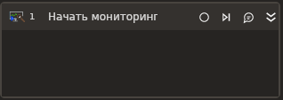

# Начать мониторинг

Элемент предназначен для запуска отслеживания запросов/ответов.

### Свойства
Описание общих свойств элемента см. в разделе [Свойства элемента](https://docs.primo-rpa.ru/primo-rpa/primo-studio/process/elements#svoistva-elementa).\
Символ `*` в названии свойства указывает на обязательность заполнения.

**Вывод:**

1. **Переменная\*** *[Primo.Request.Logger.Linux.Elements.WorkflowStartNetworkMonitoring]* - Переменная для хранения ссылки на экземпляр активности

**Конфигурация:**

1. **Фильтр** *[System.String]* - Фильтр для отслеживания запросов/ответов
1. **Порт сокета** *[System.Int32]* - Порт сокета
1. **IP адрес сокета** *[System.String]* - IP адрес сокета
