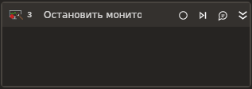

# Начать мониторинг

Элемент, запуска отслеживания запросов/ответов.

### Свойства
Описание общих свойств элемента см. в разделе [Свойства элемента](https://docs.primo-rpa.ru/primo-rpa/primo-studio/process/elements#svoistva-elementa).\
Символ `*` в названии свойства указывает на обязательность заполнения.

| Свойство             | Тип                   | Описание                                      |
| -------------------- | --------------------- | --------------------------------------------- |
| ***Вывод:***       | |  |
| Результат мониторинга\*              | System.Collection.Generic.List\<string>    | Результат мониторинга |
| ***Процесс:***       | |  |
| Переменная запуска мониторинга              | Primo.Request.Logger.Linux.Elements.WorkflowStartNetworkMonitoring    | Переменная хранящая экземпляр активности запуска мониторинга |
