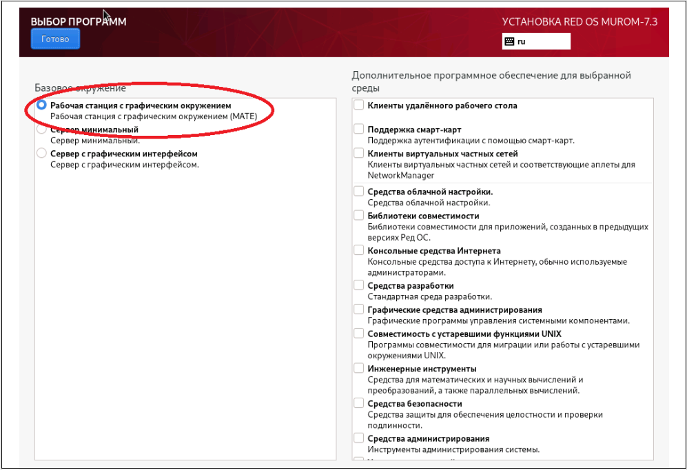
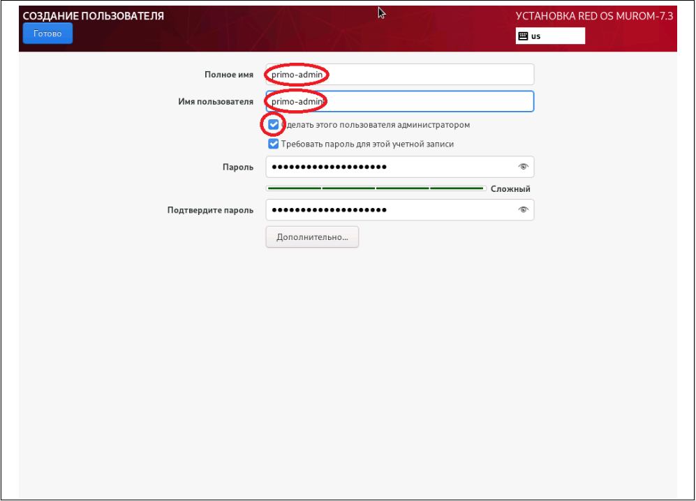
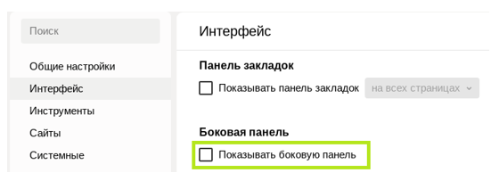

# Установка Primo RPA Studio Linux на РЕД ОС 7.3 средствами RPM пакетов
## Действия при установке РЕД ОС 7.3

При установке машины студии под управлением РЕДОС 7.3 необходимо:
- на экране **ВЫБОР ПРОГРАММ** отметить базовое окружение **Рабочая станция с графическим окружением (MATE)**;



- на экране **СОЗДАНИЕ ПОЛЬЗОВАТЕЛЕЙ** создать пользователя-администратора (далее - primo-admin).



Установка дополнительного ПО и создание дополнительных пользователей будет описана ниже.

## Настройка дополнительного ПО

1. Выполните подключение машины студии к репозиториям `base` и `updates`. Настройка локальных зеркал этих репозиториев описана в [Руководстве РЕД ОС](https://redos.red-soft.ru/base/server-configuring/service-repositories/create-repo/)

**!!ВАЖНО!! Локальные репозитории необходимо выгружать на машине, имеющей доступ в Интернет.**

Рекомендуется выделить одну машину под управлением РЕД ОС 7.3 для размещения на ней сервера репозиториев.

2. Проверьте доступность репозиториев, используя следующую команду:
```
[primo-admin@redos-studio ~]$ sudo dnf repolist
```

Репозитории `base` и `updates` должны присутствовать в выводе команды.

3. Удалите приложения для автообновления ПО (чтобы избежать засорения рабочего стола пользователя оповещениями):
```
[primo-admin@redos-studio ~]$ sudo dnf -y remove dnfdragora
```

4. Установите необходимое для работы пользователя ПО:
```
[primo-admin@redos-studio ~]$ sudo dnf -y install xsel at python3-pyatspi python3-numpy xdotool ImageMagick python3-opencv wmctrl
```

## Установка браузера Chrome

Необходимо подключить необходимый репозиторий, для этого выполните команду:
```
[primo-admin@redos-studio ~]$ sudo vim /etc/yum.repos.d/chrome.repo
```
В этот файл необходимо вставить следующий текст:

```
[chrome]
name=google-chrome - 64-bit
baseurl=http://dl.google.com/linux/chrome/rpm/stable/x86_64
enabled=1
gpgcheck=1
gpgkey=https://dl-ssl.google.com/linux/linux_signing_key.pub

```
В результате выполнения предыдущей команды должен открыться редактор VIM. Чтобы вставить текст из буфера обмена, сохранить изменения и выйти из редактора, выполните следующую последовательность команд:
```
Insert
Shift+Insert
Escape
Shift+z
Shift+z
```
Если файл уже существует и корректно заполнен, редактировать ничего не нужно. В таком случае переходите к выполнению следующей команды.
Для установки браузера Chrome выполните команду:
```
[primo-admin@redos-studio ~]$ sudo yum install google-chrome-stable
```
Проверка: выполните указанную ниже команду. Если браузер запустится, установка прошла успешно:
```
[primo-admin@redos-studio ~]$ google-chrome
```
## Установка браузера Яндекс
Для установки браузера выполните команду:
```
[primo-admin@redos-studio ~]$ sudo dnf install yandex-browser-stable
```

Проверка: выполните указанную ниже команду. Если браузер запустится, установка прошла успешно:
```
[primo-admin@redos-studio ~]$ yandex-browser-stable
```
## Установка компонентов Студии линукс
Существую следующую компоненты Студии линукс, которые можно устанавливать на машину как отдельно, так и в некоторых комбинациях:

- `Studio Linux` - включает в себя инструмент разработчика и предназначен для создания и отладки процессов.

- `Robot Runner` - включает в себя инструмент запуска процессов как в ручном режиме, так и по расписанию.

- `Browser Extensions` - компонент, который позволяет взаимодействовать браузерным активностям с браузерами Яндекс и Google Chrome по средствам специальных расширений для этих браузеров.

Типичные комбинации компонентов для установки:
- `Studio Linux` + `Robot Runner` + `Browser Extensions` - полный установочный набор для разработчика
- `Robot Runner` + `Browser Extensions` - установочный набор только для запуска процессов
- `Browser Extensions` - набор для установки на машины, где планируется запускать оркестровых роботов.

### Установка компонента Studio Linux
Скопируйте пакет `primo-studio-1.25.1.3-1.x86_64.rpm`  в удобный каталог, например: `/home/<current_user>`.

>Имя пакета может отличаться в зависимости от версии продукта, не используйте буквально

Перейдите в папку с этим пакетом и выполните установку пакета
```
[primo-admin@astra-studio ~]$ sudo dnf install ./primo-studio-1.25.1.3-1.x86_64.rpm
```
В результате компонент должен установиться по пути `/opt/primo/studio/`
>Для возможности работать с компонентом необходимо будет настроить права для группы пользователей, что будет описано ниже

### Установка компонента Robot Runner
Скопируйте пакет `primo-robot-runner-1.25.1.3-1.x86_64.rpm`  в удобный каталог, например: `/home/<current_user>`.

>Имя пакета может отличаться в зависимости от версии продукта, не используйте буквально

Перейдите в папку с этим пакетом и выполните установку пакета
```
[primo-admin@astra-studio ~]$ sudo dnf install ./primo-robot-runner-1.25.1.3-1.x86_64.rpm

```
В результате компонент должен установиться по пути `/opt/primo/robot-runner/`
>Для возможности работать с компонентом необходимо будет настроить права для группы пользователей, что будет описано ниже

### Установка компонента Browser Extensions
Скопируйте пакет `primo-web-browser-native-1.25.1.3-1.x86_64.rpm`  в удобный каталог, например: `/home/<current_user>`.

>Имя пакета может отличаться в зависимости от версии продукта, не используйте буквально

Перейдите в папку с этим пакетом и выполните установку пакета
```
[primo-admin@astra-studio ~]$ sudo dnf install ./primo-web-browser-native-1.25.1.3-1.x86_64.rpm

```
В результате компонент должен установиться по пути `/opt/primo/web-browser-native/`
>Для возможности работать с компонентом необходимо будет настроить права для группы пользователей и зарегистрировать расширение для браузеров, что будет описано ниже
## Создание группы пользователей
Для работы пользователя необходима общая группа:
```
[primo-admin@redos-studio ~]$ sudo groupadd primo-rpa
```
Задайте вновь созданную группу для всех элементов папки Студии:
```
[primo-admin@redos-studio ~]$ sudo chgrp -R primo-rpa /opt/primo/
```
Задайте права:
```
[primo-admin@redos-studio ~]$ sudo chmod -R 770 /opt/primo/
```
## Настройка учетной записи пользователя
Создание учётной записи пользователя `<any_user>`:
```
[primo-admin@redos-studio ~]$ sudo useradd -g primo-rpa -m -s /bin/bash <any_user>
```
Установка пароля учётной записи пользователя `<any_user>`:
```
[primo-admin@redos-studio ~]$ sudo passwd <any_user>`
Новый пароль : ***
Повторите ввод нового пароля : ***
passwd: пароль успешно обновлён
```
После создания учётной записи пользователя на машине Студии войдите в графический сеанс этой учётной записи для инициализации графического окружения и дальнейшей настройки.

Рекомендуется отключить фон рабочего стола для экономии памяти. Для этого используйте:  
**ПКМ на рабочем столе -> Свойства -> Обои, удалить обои и логотип**.

## Установка расширения для браузера Chrome для текущего пользователя
Откройте браузер Chrome, выберите пункт меню **Настройки и управление Google Chrome > Расширения > Управление расширениями**, далее на странице **Расширения** установите настройку **Режим разработчика**:  


Выполните перетаскивание соответствующего файла в браузер Хром на страницу **Расширения**:
* файла `/opt/primo/web-browser-native/Extensions/Chrome/chrome.crx` для установки расширения с версией манифест v2,
* файла `/opt/primo/web-browser-native/Studio/ExtensionsV3/Chrome/chrome.crx` для установки расширения с версией манифест v3.

В результате на странице должно появится расширение Primo RPA Extension:  


## Установка расширения для браузера Яндекс
Откройте браузер Яндекс, в строке адреса укажите browser://extensions/, нажмите Enter, далее на странице **Расширения** установите настройку **Режим разработчика**:  


Выполните перетаскивание соответствующего файла в браузер Яндекс на страницу **Расширения**:
* файла `/opt/primo/web-browser-native/Studio/Extensions/Chrome/chrome.crx` для установки расширения с версией манифест v2,
* файла `/opt/primo/web-browser-native/Studio/ExtensionsV3/Chrome/chrome.crx` для установки расширения с версией манифест v3.  

В результате на странице должно появиться расширение Primo RPA Extension:  


## Настройка браузеров Chrome и Яндекс для текущего пользователя

Скрипт `browsers.sh` выполняет регистрацию расширения, установленного для браузеров Хром и Яндекс, для текущего пользователя.

Запустите скрипт:

`./opt/primo/web-browser-native/browsers.sh`

Вывод консоли должен содержать повторяющуюся два раза строчку:

"Расширение успешно установлено. Перезапустите браузер."

Проверьте регистрацию расширения:

После перезапуска браузера Chrome или Яндекс должен появиться активный процесс LTools.WebBrowser.Native, который должен закрыться сразу после закрытия браузера. Процесс можно увидеть в утилите Системный монитор.

## Запуск Студии

Запустите:

`/opt/primo/studio/Primo.Studio`

## Дополнительные настройки

1. **Проблема**: «Смещение элементов в браузере Яндекс». Проблема проявляется во время выбора элемента страницы при помощи пикера браузера, при этом границы выбранного элемента не совпадают с самим элементом.  
**Решение**: В настройках «Интерфейс» -> «Боковая панель» отключите настройку «Показывать боковую панель»



2. **Проблема**: «При запуске браузера Яндекс восстанавливаются закрытые вкладки страниц».  
**Решение**: В настройках «Интерфейс»-> «Вкладки и группы» выключите настройку «При запуске восстанавливать вкладки окон и список закрепленных групп»


