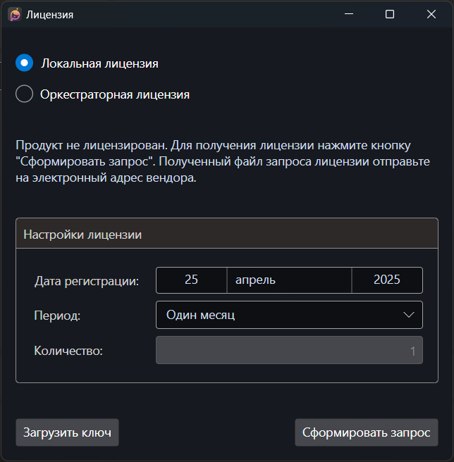

# Запуск Studio Enterprise

### Под Windows

1. Перейдите в папку с файлами приложения;
2. Запустите файл `Primo.Studio.exe`.

### Под Linux

1. Перейдите в папку с файлами приложения;
2. Откройте терминал (`bash`, `sh`) по месту расположения папки;
3. В терминале введите `./Primo.Studio`.

## Выбор лицензии

При первом запуске Primo RPA Studio Enterprise запрашивает лицензию. Для этого нужно выбрать тип лицензии и сформировать запрос вендору, после чего загрузить полученный ключ.

Существует 2 типа лицензий: локальная или оркестраторная.

В случае, если ни одна из лицензий не была выбрана, Студия закроется сразу после закрытия окна регистрации.

### Локальная лицензия

Предназначена для организаций с незначительным количеством роботов или в случае, если робот установлен на машине, которая не привязана к Оркестратору.

Лицензия привязывается к учетной записи пользователя и обновляется локально.

**Как получить**:
* В диалоге регистрации выберите **Локальная лицензия** (1).
* Укажите основные желаемые параметры вашей лицензии (2).
* Нажмите кнопку **Сформировать запрос** для формирования **файла запроса лицензии** (3).
Откроется системное диалоговое окно с предложением сохранить файл запроса лицензии.

* Отправьте сохраненный **файл запроса лицензии** вендору по адресу [License@primo-rpa.ru](mailto:License@primo-rpa.ru). В ответе придет файл лицензионного ключа с расширением \*.license.
* Загрузите его в систему нажатием кнопки **Загрузить ключ** (4).

В случае успеха окно регистрации закроется, и Студия будет готова к работе.

### Оркестраторная лицензия

Позволяет управлять лицензиями через Оркестратор. Подходит, если организация обладает большим количеством роботов и обновлением всех лицензий легче управлять из единого источника.

**Как получить**:
* В диалоге регистрации выберите **Оркестраторная лицензия** (1).
* Отобразится форма подключения Студии к Оркестратору (2). Введите учетные данные пользователя, под которым Студия будет обращаться в Оркестратор.

***Что это значит?*** Администратор Оркестратора предварительно должен [создать пользователя](https://docs.primo-rpa.ru/primo-rpa/orchestrator/settings/users/orch-users) с ролью `Studio`, после чего передать его данные вам, включая тенант пользователя и адрес Оркестратора:*

* Нажмите **Соединиться** (3).

При успешном подключении Студия запросит у Оркестратора свободную лицензию. Если она ее получит, то окно регистрации закроется, и Студия будет готова к работе.

### Студия не запускается

#### Под Windows

При использовании антивируса возможны проблемы с открытием Студии. Чтобы их избежать, добавьте файл `LTools.Selector.exe` (или всю папку Студии) в исключения антивируса. Файл `LTools.Selector.exe` находится в папке установки программы. Пример:

Также рекомендуем ознакомиться с инструкцией [по мультисессионной работе](https://docs.primo-rpa.ru/primo-rpa/primo-studio/settings/layout/multisession).
