# ВЕРСИЯ ПОД WINDOWS

# Работа с кодом

Студия предоставляет возможность разрабатывать сценарии автоматизации в режиме чистого кода - Pure code. Для этого при создании сценария - или, иначе, *процесса* - выберите тип **Только код** (1) и укажите язык программирования (2).

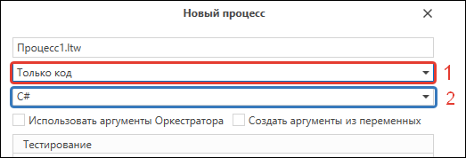

По умолчанию используется язык С#, но вместо него вы можете выбрать Python или JavaScript. После создания процесса откроется редактор кода для работы с элементами:

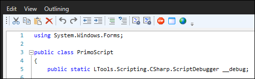

#### Как добавить в процесс элемент?

На панели *Элементы* найдите нужный компонент и перетащите в редактор кода - будет создан образец для его вызова.

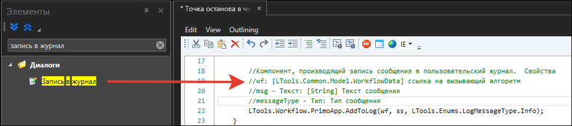

В разделах, посвященных описанию элементов, как правило, можно найти подраздел *Только код* - он содержит примеры использования элементов в чистом коде. См. пример для элемента [Получить значение](https://docs.primo-rpa.ru/primo-rpa/g_elements/el_basic/els_orch/els_assets/el_orch_getvalue#tolko-kod):

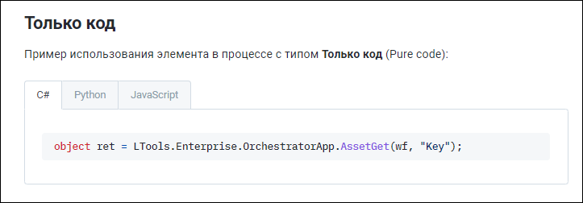

#### Как в процессе вызвать другой процесс?

Чтобы вызвать другой процесс, перетащите соответствующий файл процесса из панели проекта в код.

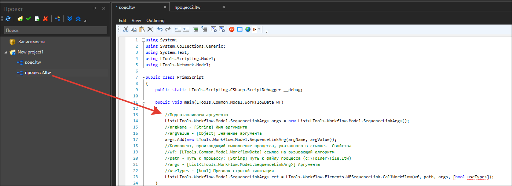

#### Как использовать аргументы?

Код поддерживает [аргументы](https://docs.primo-rpa.ru/primo-rpa/primo-studio/process/args) - переменные для обмена данными между процессами. Работа с ними не отличается от других типов процессов. Для работы с аргументами также можно использовать методы GetArgument и SetArgument глобальной переменной [wf](https://docs.primo-rpa.ru/primo-rpa/primo-studio/process/workflow).

#### Как создать шаблон поиска?

В меню редактора кода находятся кнопки  - используйте их, чтобы создать [шаблон поиска](https://docs.primo-rpa.ru/primo-rpa/primo-studio/process/searchpatterns) элемента управления. При необходимости отредактировать шаблон, выделите его в коде и также используйте одну из этих кнопок.

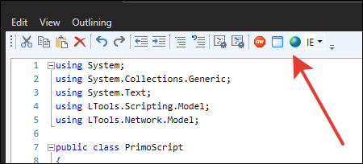

#### Как установить точку останова?

Нажмите в меню редактора кнопку .

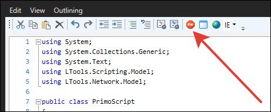

В коде появится строка вызова точки останова:

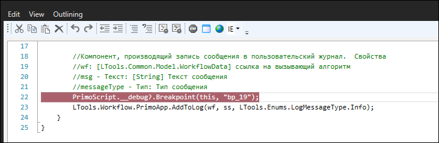

:bangbang: ***В языках Python и JavaScript последний параметр отвечает за номер строки точки останова.***

Обращаем внимание, что в версии Студии 23.11 для отладчика чистого кода реализована версия ядра v2. Среди ее преимуществ:
* Вместо кода для точки останова теперь используются цветовые индикаторы (см. на рисунке ниже).
* Стали видны текущие значения локальных переменных функции. В версии ядра v1 в панели **Вывод** отображаются только текущие значения переменных класса.
* На точке останова стало возможным перейти к коду функции.

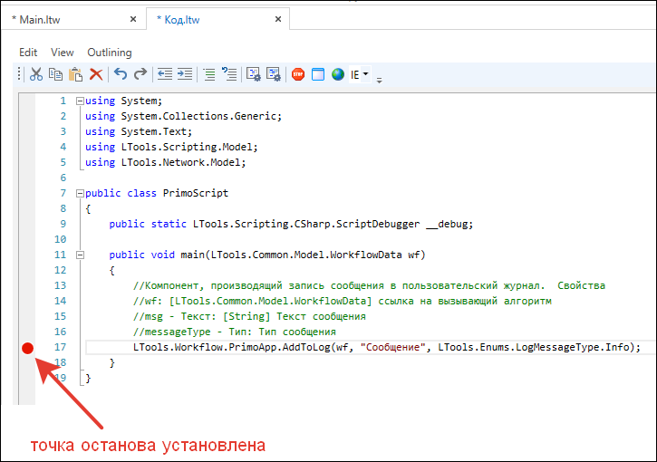

Выбрать ядро отладчика чистого кода можно в окне [настроек](https://docs.primo-rpa.ru/primo-rpa/primo-studio/settings#otladchik) Студии. По умолчанию используется версия v1.

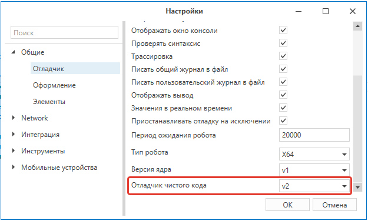

 > :small_orange_diamond: Если вы меняете версию ядра, **обязательно перезагрузите Студию.**\
 > :small_orange_diamond: Если вы меняете ядро в проектах, где были использованы точки останова, заданные кодом (v1), удалите их и установите новые (v2). Это поможет избежать проблем совместимости.\
 > :small_orange_diamond: Нельзя использовать неинициализированные переменные с отладчиком `v2`.

#### Где посмотреть текущее значение переменных при отладке?

Добавьте точку останова к нужному элементу и примените команду **Отладить процесс**.

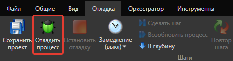

На панели **Элементы/Проект** вызовите контекстное меню и выберите пункт **Закрытые панели**.

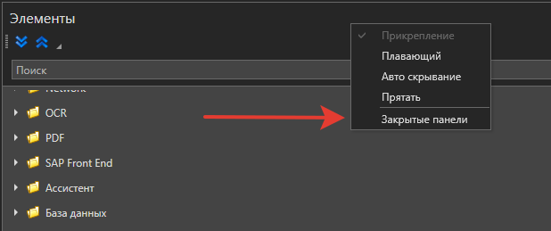

Нажмите появившуюся кнопку **Вывод**, чтобы отобразить панель.

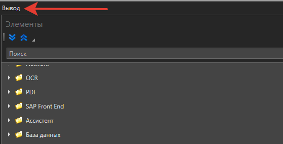

Перейдите на панель **Вывод**, нажав соответствующую кнопку внизу.

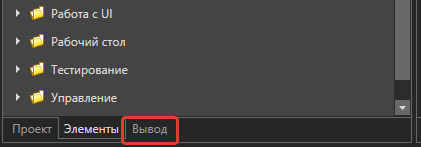

Просмотрите состояния переменных на момент остановки выполнения кода.

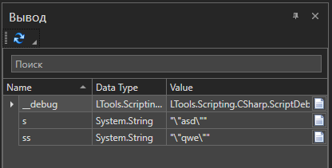

Если в панели **Вывод** отображаются неверные данные - например, с прошлой отладки в режиме последовательности - просто нажмите кнопку **Обновить**.

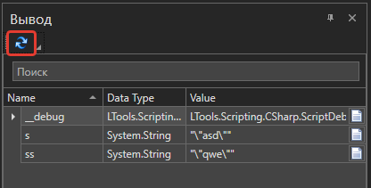

## Ограничения

В зависимости от выбранного языка, правила оформления и работа с кодом будут отличаться. Например, в языке C# будет создана специальная переменная **\_\_debug**, отвечающая за работу с отладчиком.

Также в языках присутствуют следующие ограничения:
* В языке Python в панели **Переменные** отображаются только переменные, имена которых начинаются с символа подчеркивания.
* Язык JavaScript не поддерживает отображения переменных и панели **Наблюдение**.
* Панель **Наблюдение** работает только с видимыми переменными.

## Примеры использования

На странице [Learning](https://github.com/PrimoRPA/Learning) доступен RPA-проект **PureCode**. Он содержит примеры использования элементов в процессах с типом **Только код**. В проекте находятся 3 подпапки - С, JS, Python - они соответствуют выбранному языку при создании процесса.

Как открыть проект:

1. Скачайте архив со всеми обучающими материалами по ссылке: [Скачать архив Learning](https://github.com/PrimoRPA/Learning/archive/refs/heads/master.zip).
2. Распакуйте архив, запустите Студию и откройте проект из папки **PureCode** (файл `project.ltp`).
3. Просмотрите `README.md`, чтобы ознакомиться с содержанием проекта, после чего откройте интересующий процесс.
