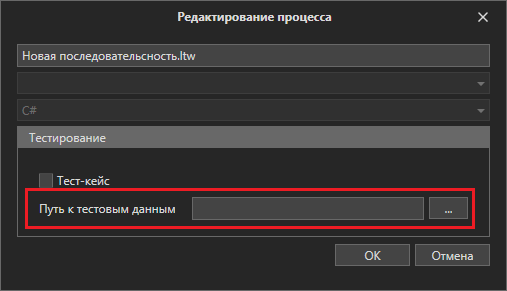
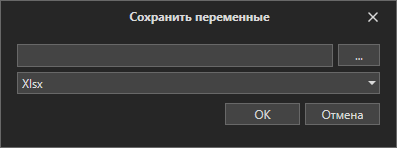

# ВЕРСИЯ ПОД WINDOWS

# Тестирование

**Базовые элементы тестирования**

Для базового тестирования применяются элементы [**Проверка выражения**](https://docs.primo-rpa.ru/primo-rpa/g_elements/osnovnye-elementy/testing/verifyexpression) и [**Проверка выражения с оператором**](https://docs.primo-rpa.ru/primo-rpa/g_elements/osnovnye-elementy/testing/verifyexpressionwithoperator). Эти элементы вычисляют заданное выражение и генерируют исключение в случае неуспешной проверки. В момент начала выполнения проекта у компонентов тестирования устанавливается значок  , а по результатам выполнения либо  при успехе, либо  в случае неудачи.

Более сложным элементом является **Проверка результатов с оператором**. Он выполняет встроенный в него элемент (например, получение атрибута) и сверяет его результат с указанным выражением. Наиболее подходящим использованием данного элемента являются UI-тесты.

**Тестовые данные**

Тестовые данные являются частью проекта и устанавливаются в окне свойств процесса:

Путь к тестовым данным может быть как абсолютным, так и относительным. В качестве тестовых данных используется файл Excel формата:

| Имя переменной 1 | Имя переменной 2 | Имя переменной n |
| ---------------- | ---------------- | ---------------- |
| Значение 1       | Значение 2       | Значение 3       |
| Значение 1n      | Значение 2n      | Значение 3n      |

Получить значение из массива тестовых данных можно при помощи элемента [**Получить следующие локальные тестовые данные**](https://docs.primo-rpa.ru/primo-rpa/g_elements/osnovnye-elementy/testing/getnextlocaltestdata). Компонент может как выгрузить данные в переменную, так и автоматически установить значения всем переменным по именам.

Тестовые данные можно как создать вручную, так и сформировать на основе имеющихся значений переменных, используя раздел меню **Отладка ➝ Сохранить переменные**, после чего в открывшемся окне указать путь к файлу сохранения:

**Заглушки**

Элемент [**Заглушка**](https://docs.primo-rpa.ru/primo-rpa/g_elements/osnovnye-elementy/testing/mock) имеет два подконтейнера: *Элемент* и *Заглушка*.

Последовательность в подконтейнере *Элемент* выполняется, если заглушка выключена, а элементы в контейнере *Заглушка*, если включена. Работой отдельных заглушек можно управлять из их свойств, реагирование на включенные заглушки настраивается при помощи кнопки  на вкладке меню *Отладка*.

Подробнее работа элемента описана в разделе [**Заглушка**](https://docs.primo-rpa.ru/primo-rpa/g_elements/osnovnye-elementy/testing/mock).
