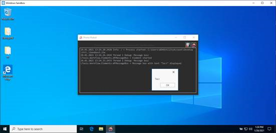
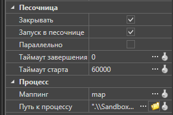

# ВЕРСИЯ ПОД WINDOWS

# Песочница

**Установка Песочницы Windows**

1. Убедитесь, что на вашем компьютере используется Windows 10 Pro или Корпоративная, сборка 18305 или более поздней.
2. Виртуализация на компьютере:
   * Если Вы используете физический компьютер, убедитесь, что возможности виртуализации включены в BIOS.
   * Если Вы используете виртуальную машину, запустите следующую команду PowerShell, чтобы включить вложенную виртуализацию:\
     **Set-VMProcessor -VMName \<VMName> -ExposeVirtualizationExtensions $true**
3. Используйте планку поиска на панели задач и введите **Включить и отключить функции Windows**, чтобы получить доступ к средству дополнительных компонентов Windows. Выберите **Песочницу Windows,** а затем — **ОК.** Перезапустите компьютер, если вам будет предложено.
   * Если параметр **Песочница Windows** недоступен, то компьютер не соответствует требованиям для запуска песочницы Windows. Если вы считаете это неправильным, просмотрите список необходимых условий, а также шаги 1 и 2.

**Работа с Песочницей**

Для запуска процесса в песочнице необходимо вызвать его из процесса робота при помощи элемента [**Ссылка на процесс**](https://docs.primo-rpa.ru/primo-rpa/g_elements/osnovnye-elementy/els_logic/el_logic_link). Для включения режима песочницы установите флаг **Запуск в песочнице** в свойствах элемента:

**ВНИМАНИЕ! Основной и вспомогательный робот могут обмениваться только простыми данными (String, [Double](https://learn.microsoft.com/ru-ru/dotnet/api/system.double?view=net-5.0&viewFallbackFrom=windowsdesktop-3.0), [DateTime](https://learn.microsoft.com/ru-ru/dotnet/api/system.datetime?view=net-5.0), Boolean и т.д.) либо коллекциями простых данных (List\<String>, List\<DateTime> и т.д.)**

Для того чтобы песочница закрывалась по завершении работы процесса, используйте флаг **Закрывать**.

Свойство **Таймаут старта** - это количество миллисекунд, которое нужно ожидать до старта дополнительного робота.\
Свойство **Таймаут завершения** - это количество миллисекунд, которое нужно ожидать до завершения работы дополнительного робота (в не-параллельном режиме) (0 - бесконечно).

Робота можно запускать параллельно с основным роботом (флаг **Параллельно**), но в этом случае аргументы, возвращенные дополнительным роботом, получены не будут.
