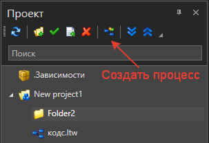
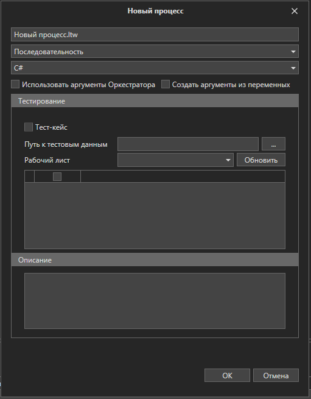
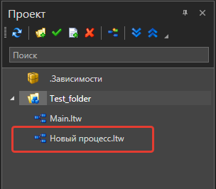
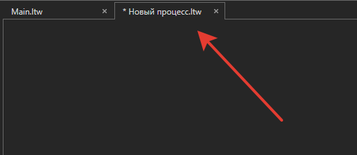
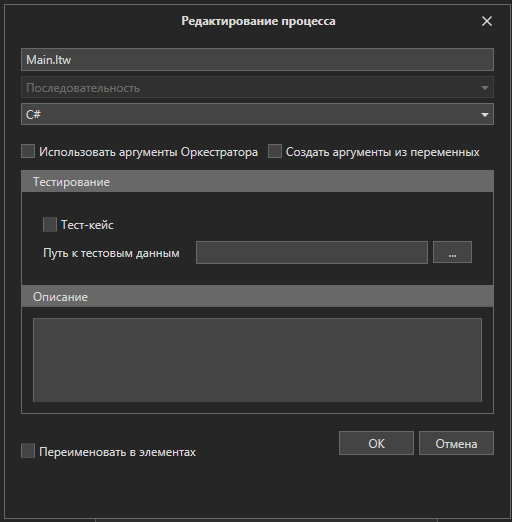
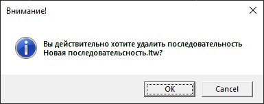

# ВЕРСИЯ ПОД WINDOWS

# Работа с процессами

Процесс — это сценарий автоматизации бизнес-процесса, собранный из элементов Студии. [Элемент](https://docs.primo-rpa.ru/primo-rpa/primo-studio/process/elements) представляет собой действие, которое робот должен выполнить после запуска сценария.

Процесс является частью [RPA-проекта](https://docs.primo-rpa.ru/primo-rpa/primo-studio/projects), таким образом, в одном проекте может быть множество процессов. Деление на процессы RPA-разработчик осуществляет на свое усмотрение.

## Создать процесс

:small_blue_diamond: **Предусловие**. В Студии уже [создан](https://docs.primo-rpa.ru/primo-rpa/primo-studio/projects#kak-sozdat-proekt) и открыт RPA-проект.

На панели «Проект» выберите папку для будущего процесса и нажмите **Создать процесс**.

Откроется форма создания процесса:

Укажите параметры процесса:

1. Введите имя процесса с обязательным расширением .ltw.
2. Выберите тип процесса: «[Последовательность](https://docs.primo-rpa.ru/primo-rpa/primo-studio/process/sequence)», «[Диаграмма](https://docs.primo-rpa.ru/primo-rpa/primo-studio/process/diagram)» или «[Только код](https://docs.primo-rpa.ru/primo-rpa/primo-studio/process/coding)». По умолчанию установлен тип «Последовательность» — каскадный алгоритм из элементов, выполняющихся последовательно.
3. Выберите язык программирования (C#, Python или JavaScript).\
	:bangbang: ***Не используйте разные языки в одном проекте. Это обусловлено разницей подходов к типизации данных в языках C#, Python и Javascript.***
4. Укажите, нужно ли использовать [аргументы Оркестратора](https://docs.primo-rpa.ru/primo-rpa/primo-studio/process/args#argumenty-orkestratora) — возможность просматривать/изменять аргументы RPA-проекта напрямую из Оркестратора.
5. Укажите, нужно ли создавать аргументы из переменных.
6. В блоке **Тестирование** определите, хотите ли вы использовать в проекте тестовые данные. Подробнее см. в разделе [Тестирование](https://docs.primo-rpa.ru/primo-rpa/primo-studio/process/debug/testing). Для использования тестовых данных:
   * Установите чекбокс **Тест-кейс**.
   * Укажите путь до файла с данными — абсолютный или относительный. В качестве тестовых данных используется файл Excel.
   * Чтобы указать рабочий лист файла, нажмите кнопку **Обновить** и выберите лист в списке значений. Если значение не указано, по умолчанию будет использован первый лист книги.
   * В результате будут выбраны все строки и столбцы указанного листа. Если есть необходимость, отредактируйте их выбор.
8. При желании добавьте краткое описание процесса в соответствующем поле.
9. Нажмите **ОК**, чтобы добавить процесс в проект.

Новый процесс отобразится на панели «Проект».

А также по умолчанию откроется в основной рабочей области.

## Изменить процесс
Форма редактирования процесса открывается по команде контекстного меню. Для этого на панели «Проект» выберите процесс, вызовите его контектное меню и используйте команду **Редактировать элемент**.

## Удалить процесс

Перейдите на панель «Проект», выберите процесс и вызовите его контектное меню. После чего используйте команду **Удалить элемент** и подтвердите действие.

## Открыть / закрыть процесс

Чтобы открыть существующий процесс, дважды щелкните его название в панели «Проект» — процесс откроется в виде новой вкладки в рабочей области.

Чтобы завершить работу с процессом, достаточно сохранить изменения и закрыть его вкладку.

## Дополнительно
В зависимости от того, какой тип процесса вы выбрали, рекомендуем ознакомиться с одним из следующих разделов:
*  [Работа с последовательностью](https://docs.primo-rpa.ru/primo-rpa/primo-studio/process/sequence);
*  [Работа с диаграммой](https://docs.primo-rpa.ru/primo-rpa/primo-studio/process/diagram);
*  [Работа с чистым кодом](https://docs.primo-rpa.ru/primo-rpa/primo-studio/process/coding).
