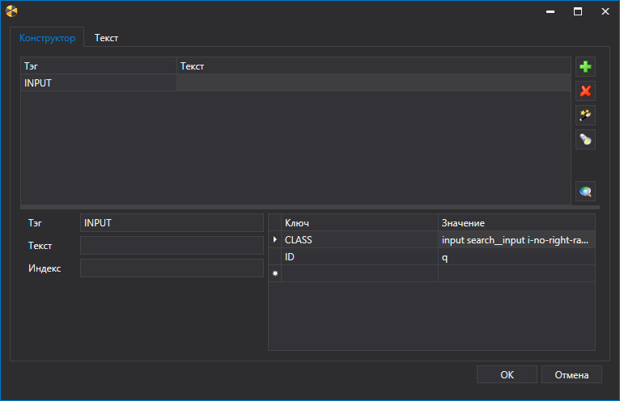
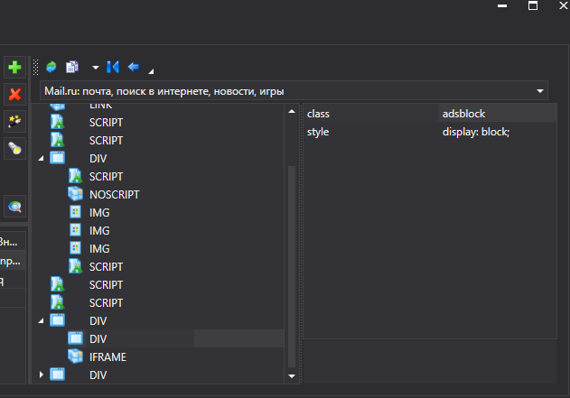
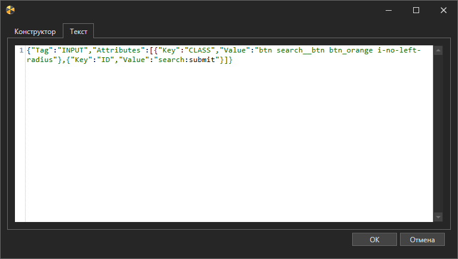
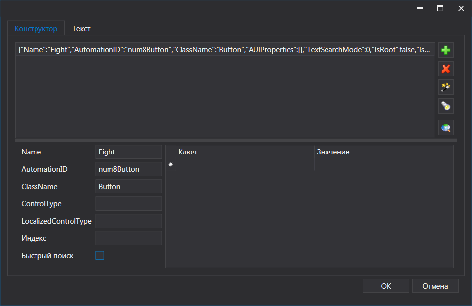
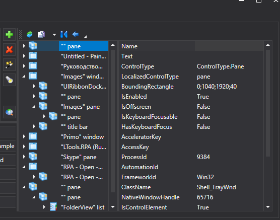
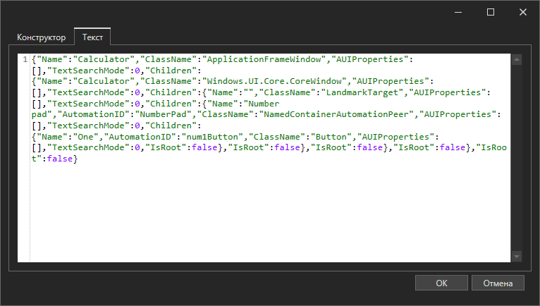

# ВЕРСИЯ ПОД WINDOWS

# Поколение 1

Свойство шаблона поиска содержит кнопку «…», по нажатию на которой появляется окно визуального редактирования шаблона (зависит от типа элемента).

На данный момент, шаблоны поиска имеются у элементов следующих категорий:

* Группа элементов Браузер
* Группа элементов Рабочий стол

## Браузер

Шаблон поиска элементов Браузер выглядит следующим образом

Для добавления элемента шаблона нужно нажать кнопку  , после чего выделить новую строку и ввести данные в поля Тэг, Текст, Индекс (начинается с единицы) и Поиск во фреймах (поиск внутри элементов iframe). Для уточнения поиска можно ввести имена и значения атрибутов тэга в таблицу (ключ, значение). Если указать несколько строк, поиск элемента в браузере будет вестись вглубь от самого верхнего шаблона.

Для удаления шаблона можно использовать кнопку , либо нажать кнопку Del.

Шаблон можно сформировать автоматически, нажав кнопку Выбрать компонент  и в нужном окне браузера кликнуть искомый элемент. Также можно использовать быструю кнопку на самом элементе.

При нажатии кнопки Отобразить компонент , будет выделен элемент управления, обозначенный в текущем шаблоне.

Кнопка Инспектор UI  служит для отображения/скрытия модуля исследования интерфейсов

В данном модуле можно исследовать структуру приложения. При помощи кнопок  и  происходит перенос выбранных элементов в шаблон.

Шаблон поиска представляет собой строку формата JSON, содержащую все необходимые для поиска атрибуты. Шаблон можно ввести вручную, перейдя на закладку Текст.

## Рабочий стол

Шаблон поиска элементов Рабочий стол выглядит следующим образом

Для добавления элемента шаблона нужно нажать кнопку  , после чего выделить новую строку и ввести данные в поля Name, AutomationID, ClassName, ControlType, LocalizedControlType и Индекс (начинается с единицы). Для уточнения поиска можно ввести имена и значения атрибутов искомого компонента в таблицу (ключ, значение). Если указать несколько строк, поиск элемента в роботизируемом приложении будет вестись вглубь от самого верхнего шаблона. Для укороченного маршрута необходимо отметить чек-бокс "Быстрый поиск"

Для удаления шаблона можно использовать кнопку , либо нажать кнопку Del.

Шаблон можно сформировать автоматически, нажав кнопку Выбрать компонент  и в окне нужного приложения кликнуть искомый элемент. Также можно использовать быструю кнопку на самом элементе.

При нажатии кнопки Отобразить компонент , будет выделен элемент управления, обозначенный в текущем шаблоне.

Кнопка Инспектор UI  служит для отображения/скрытия модуля исследования интерфейсов

В данном модуле можно исследовать структуру приложения. При помощи кнопок  и  происходит перенос выбранных элементов в шаблон.

Шаблон поиска представляет собой строку формата JSON, содержащую все необходимые для поиска атрибуты. Шаблон можно ввести вручную, перейдя на закладку Текст.

