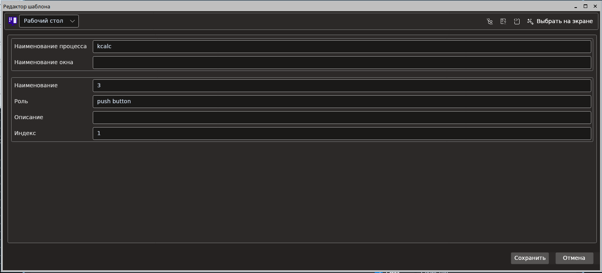
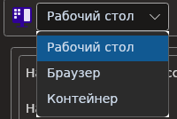
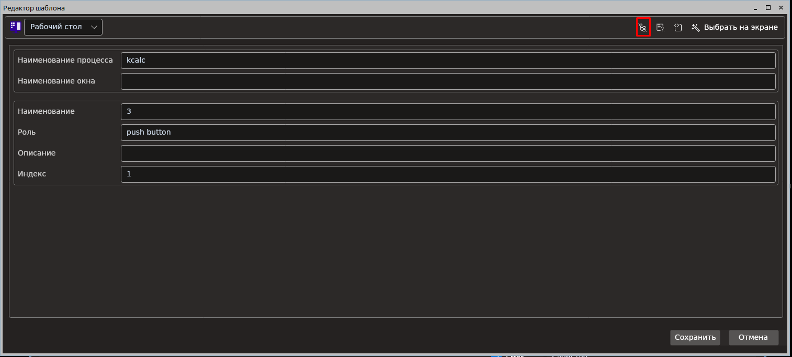
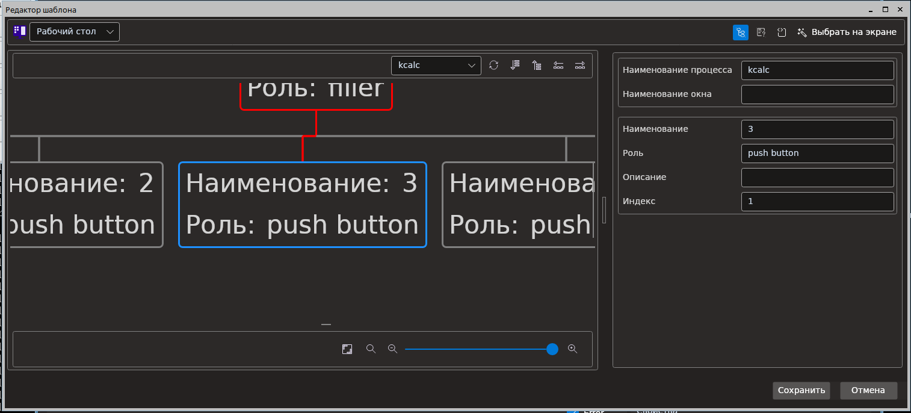
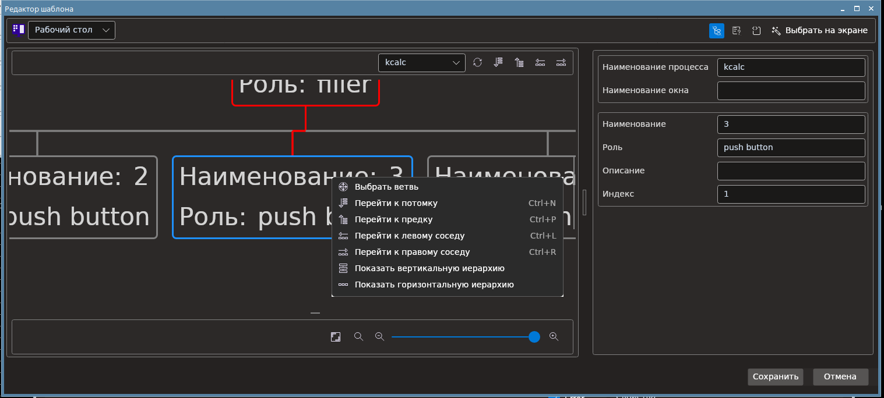
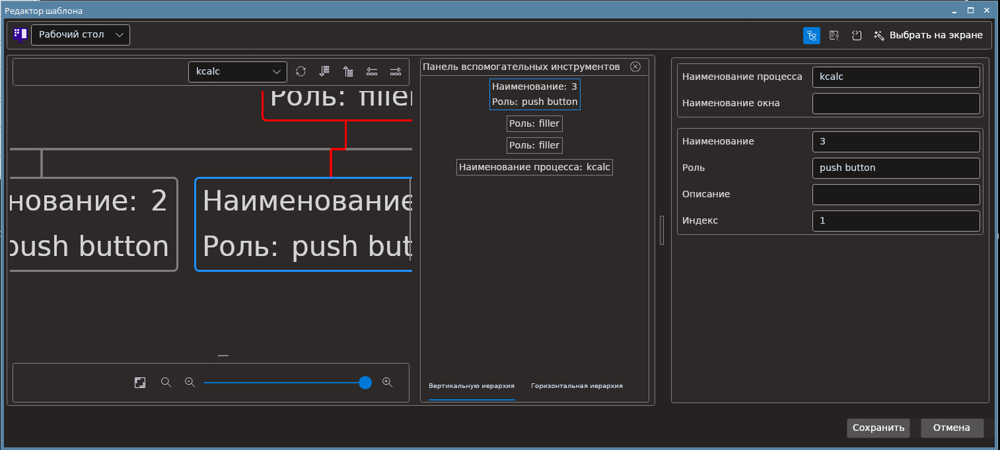
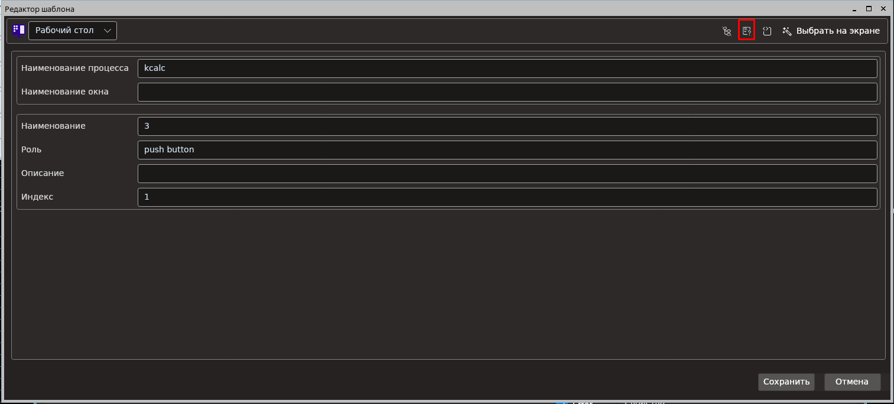
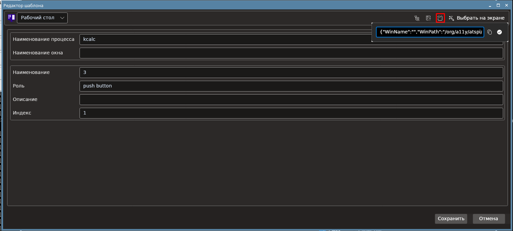
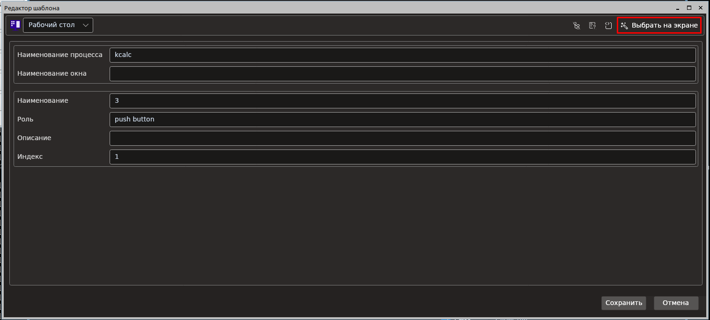

# Новый редактор шаблона поиска

  

В левом верхнем углу можно выбрать тип оптимизации.

  

Новый редактор шаблона поиска позволяет работать с деревьями элементов управления.

Для того что бы открыть дерево необходимо нажать на кнопку:

  

Внешний вид дерева выглядит следующим образом:

  

С помощью верхней панели инструментов есть возможность делать следующие действия:
 * Выбрать дерево необходимого приложения
 * Обновить дерево
 * Перейти к потомку относительно выбраного узла
 * Перейти к претку относительно выбранного узла
 * Перейти к левому соседу относительно выбранного узла
 * Перейти к правому соседу относительно выбранного узла

 Так же у каждого узла можно открыть контекстное меню нажав на него правой кнопкой мыши.

   

В контекстном меню есть возможность делать следующие действия:

* Выбрать узел как целевой для шаблона поиска
* Перейти к потомку относительно выбраного узла
* Перейти к претку относительно выбранного узла
* Перейти к левому соседу относительно выбранного узла
* Перейти к правому соседу относительно выбранного узла
* Показать вертикальную иерархию относительно выбранного узла
* Показать горизонтальную иерархию относительно выбранного узла

Окно показа вертикальной и горизонтальной иерархии выглядит следующим образом:

   

Проверка коректности шаблона поиска происходит с помощью нажатия на кнопку:

   

Так в новом редакторе шаблона поиска есть позможность работать с шаблоном поиска в виде строки Json. Для этого небходимо нажать следующию кнопку:

   

По нажатию откроется панель с представленим шаблона поиска в виде строки Json. В данной панели, с помощью соответствующих кнопок можно:
 * Скопировать строку Json в бувер обмена
 * Сохранить изменения шаблона поиска.

Так же по нажатию кнопки "Выбрать на экране" можно выбрать элемент пикиром.

   
