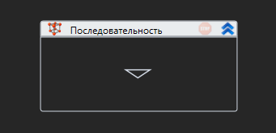
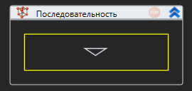
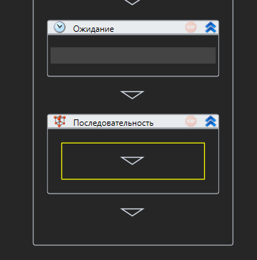
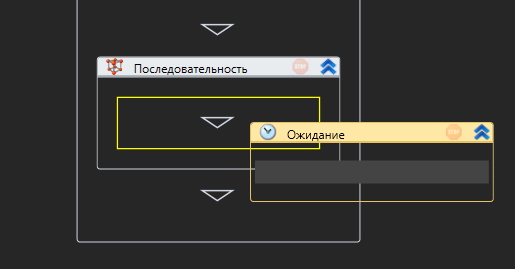
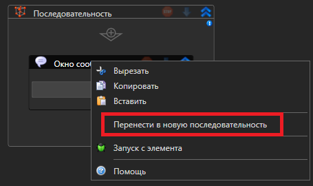
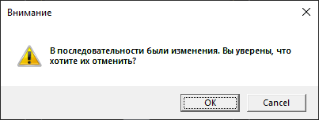

# ВЕРСИЯ ПОД WINDOWS

# Работа с последовательностью

Все элементы процесса-последовательность делятся на две категории:

* стандартный элемент
* контейнер

Новый процесс-последовательность состоит из одного чистого контейнера:

В своей основе процесс-последовательность может иметь только один контейнер **Последовательность**, который и будет содержать всю логику сценария.

Масштаб отображения процесса возможно изменять с помощью специального элемента управления, который расположен в правом нижнем углу:

## Добавление элементов

Для добавления элементов в контейнер **Последовательность** необходимо перетащить нужный компонент из панели _Элементы_ в знак треугольника контейнера. При этом вокруг треугольника должна появиться желтая рамка:

Аналогичным способом происходит добавление новых контейнеров, а также добавление элементов в каждый из подконтейнеров:

## Перемещение элементов

Для перемещения элементов внутри процесса существует два способа:

1. **Перетаскивание.** Необходимо захватить мышью заголовок элемента и перенести его на нужный треугольник, при этом вокруг треугольника появится желтая рамка:

1. **Использование буфера обмена**. Выделите нужный элемент, нажав на него мышью, либо выделите несколько элементов, зажав клавишу `Ctrl`. После этого нажмите кнопку **Копировать** или кнопку **Вырезать** на вкладке меню _Общие_ (можно выбрать эти функции из контекстного меню выделенного элемента либо использовать горячие клавиши `Ctrl+C` и `CTRL+X`). Для переноса выделите элемент, после которого нужно совершить вставку, либо контейнер, внутрь которого следует вставить компонент из буфера. После чего нажмите кнопку **Вставить** либо сочетание клавиш `Ctrl+V`.

Для переноса элемента в новую последовательность можно воспользоваться соответствующим пунктом контекстного меню:

## Управление элементами

Если элемент занимает слишком много места, его можно свернуть нажатием кнопки **Свернуть** . Она находится на панели элемента. Свернутый элемент возможно вновь показать полностью по нажатию кнопки **Развернуть** .

Чтобы удалить элемент, выделите его мышью и используйте клавишу `Del`. Для удаления нескольких элементов - выберите их, зажав клавишу `Ctrl`, после чего нажмите `Del`.

Символ  на панели элемента обозначает, что в нем присутствуют ошибки. При наведении мыши на значок, появится подсказка о содержании ошибок:

## Работа с изменениями

Для отмены последнего изменения используйте кнопку **Отменить**  на вкладке меню _Общие_ либо сочетание клавиш `Ctrl+Z`.

Для возвращения последнего отмененного действия предназначена кнопка **Повторить** , а также сочетание клавиш `Ctrl+Y`.

В случае внесения изменений в процесс, в заголовке закладки процесса появится символ \*:

При попытке закрытия закладки измененного процесса будет выведено соответствующее сообщение:

