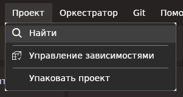

# ВЕРСИЯ ПОД LINUX

# Поиск

Чтобы осуществить поиск в проекте, выберите пункт меню **Проект -> Найти** или клавиши `Ctrl+F` для открытия окна поиска.

Окно поиска:

Введите запрос в соответствующее поле и нажмите кнопку **Искать** или клавишу `Enter`. Включение параметра **Искать в закрытых** активирует поиск в закрытых последовательностях и диаграммах.

Результат отобразится в таблице под строкой запроса. Для перехода к найденному элементу дважды кликните нужный элемент в таблице результатов.

Обратите внимание на колонку **Номер**: в ней выводится информация о номере, который присвоен элементу в процессе. 

Управление автонумерацией элементов осуществляется в разделе меню **Настройки ➝ Общие ➝ Оформление** при помощи параметра **Отображать нумерацию**.
