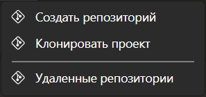
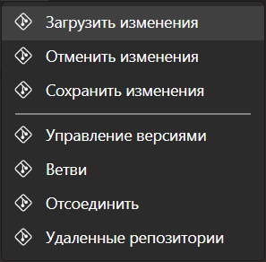
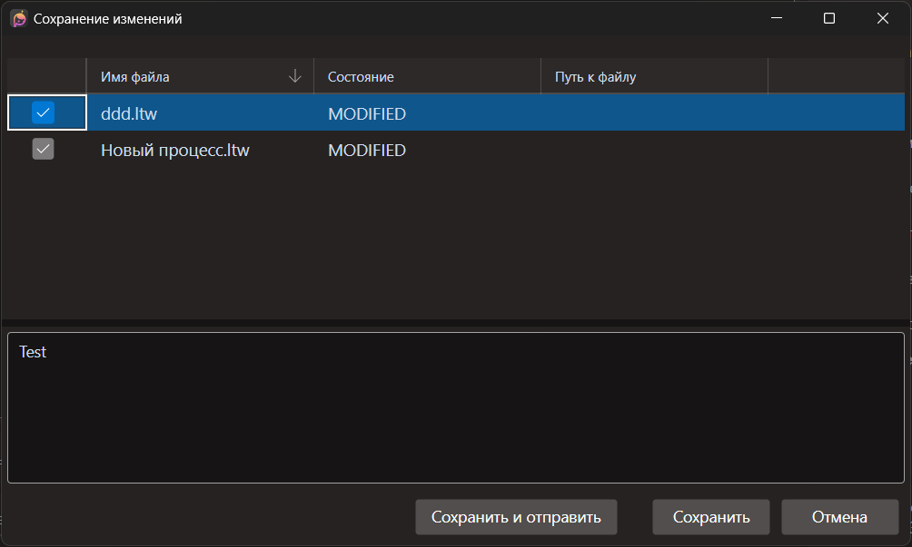
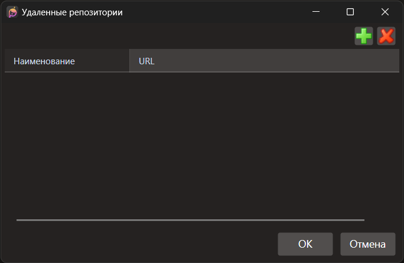
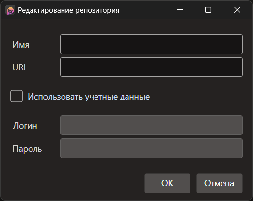
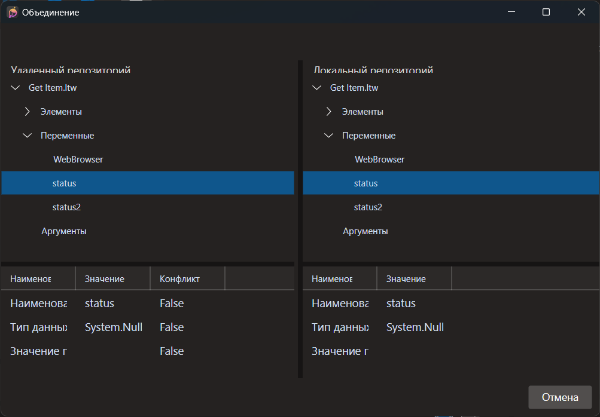
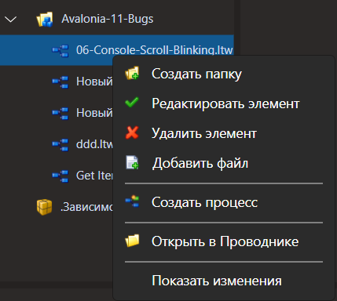
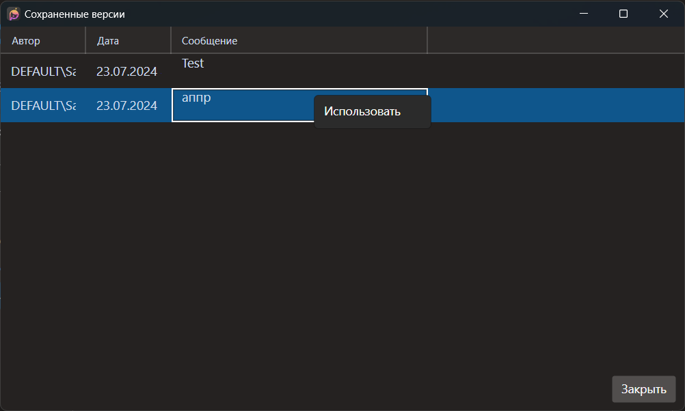
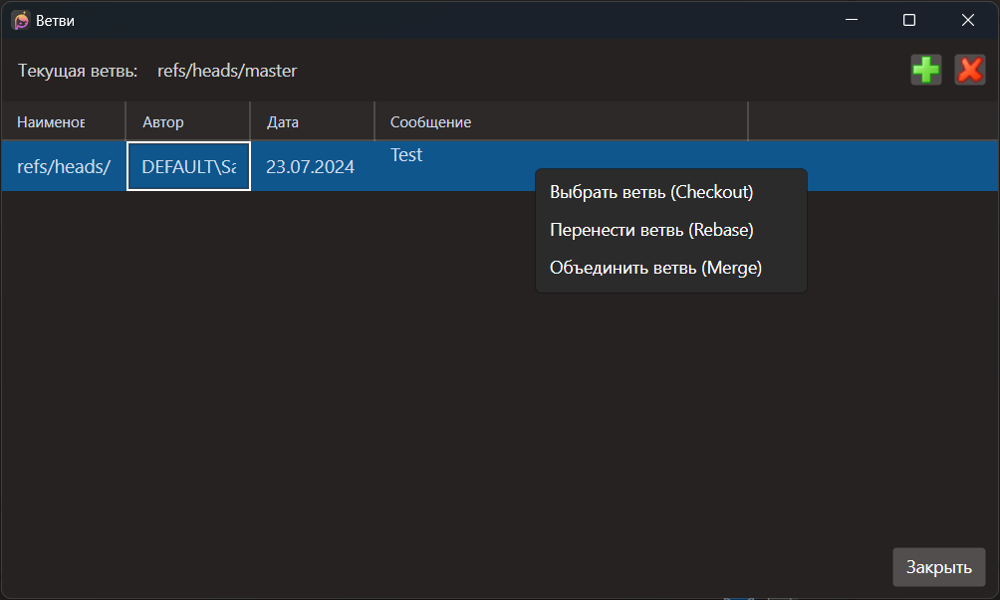

# ВЕРСИЯ ПОД LINUX

# Контроль версий

`Git` - распределенная система версионирования с широкими функциональными возможностями, которые в полной мере нельзя отразить в кратком руководстве. Полную информацию о возможностях `git`, его принципах и работе с этой системой можно найти [здесь](https://git-scm.com/book/en/v2).

Для управления сохранением версий исходных кодов в системе присутствует минимально-необходимый набор инструментов для работы с хранилищем (репозиторием) `git`, представленный в соответствующем тематическом подменю **Git** главного окна.

До того, как пользователь не откроет какой-либо проект, пункты подменю **Git** не будут выполнять каких-либо полезных действий.

При открытии проекта, подменю **Git** изменится в зависимости от того, имеется ли у открытого проекта git-хранилище (репозиторий), или нет.

Если у проекта не имеется `git`-хранилища, то подменю **Git** будет выглядеть следующим образом:

Если у проекта уже имеется `git`-хранилище, то подменю **Git** будет таким:

В случае, если у проекта хранилища еще нет, для дальнейшей работы с `git` придется его *создать*.

При создании хранилища придется учесть тот момент, что оно может быть как исключительно локальным, так и синхронизируемым со своей удаленной копией (или копиями).

В первом случае, достаточно выбрать пункт меню "Создать репозиторий", и выбрать путь к хранилищу. *Исключительно и настоятельно рекомендуется выбирать папку с проектом в качестве папки размещения хранилища:* не смотря на возможность указать любую папку для размещения хранилища на данный момент, при указании какой-либо иной папки `git` может работать некорректно.

Если необходимо создать хранилище, синхронизируемое со своей удаленной копией, то желательно проделать следующую последовательность шагов для корректной работы с хранилищем:
 - Создать удаленную пустую копию (`bare`) будущего локального хранилища;
 - Произвести клонирование удаленной пустой копии локального хранилища в папку с проектом, открытым на данный момент (**Git > Клонировать проект**);
 - Произвести сохранение первых изменений (коммит) с выбором кнопки "Сохранить и отправить";
 - Переоткрыть проект.

После создания/настройки репозитория для проекта, можно пользоваться остальным имеющимся функционалом для работы с `git`.

Рассмотрим этот функционал.

Для сохранения версии в локальном хранилище `git`, нужно выбрать пункт меню "Сохранить изменения".

Кнопка "Сохранить" зафиксирует изменения в локальном хранилище `git`. Кнопка "Сохранить и отправить" вызовет также диалоговое окно настройки удаленных хранилищ `git` для текущего проекта (Git, GitHub, TFS и т.д.)

Нажав на кнопку "+", можно сконфигурировать и добавить необходимое удаленное хранилище.

**Внимание! Для работы с хранилищем Azure, необходимо включить альтернативный способ авторизации.**

При этом, при отправке возможны конфликты состояния локального и удаленного репозитория (соответствующих веток (`branch`)) с предложением их разрешения, о которых предупредит соответствующее диалоговое окно.

При выборе варианта "Перезаписать удаленную", версия удаленного репозитория будет заменена на локальную (фактически, `push -force`). При выборе варианта "Загрузить изменения", `git` попытается объединить (`merge`) удаленную и локальную версии. В случае наличия неразрешимых конфликтов, будет представлен диалог объединения изменений, в котором необходимо определить, какие версии (локальная или удаленная) будут использованы в дальнейшем.

Для выбора версии необходимо выделить обрабатываемый процесс и нажать кнопку "Применить удаленный" либо "Применить локальный" в верхней части окна. После устранения всех конфликтов, нужно нажать кнопку "Сохранить". После завершения всех операций, хранилища необходимо повторно синхронизировать через кнопку "Сохранить и отправить".

Пункт меню "Отменить изменения" позволяет отменить последние изменения (эквивалентно `hard-reset` на предыдущую версию/фиксацию (`commit`)).

Для получения последних изменений удаленного хранилища, нужно нажать кнопку "Загрузить изменения" меню **Git**. Объединение версий произойдет по тем же правилам, что и при отправке.

Для сравнения локальной версии с репозиторием, необходимо нажать правой кнопкой на файле  в палитре Проект и выбрать меню "Показать изменения"

Пункт меню "Управление версиями" подменю **Git** служит для отката к определенной сохраненной версии (эквивалентно `hard-reset` на выбранную версию). Для этого нужно выбрать нужную версию, нажать на ней правой кнопкой мыши и нажать "Использовать".

Пункт меню "Ветви" подменю **Git** служит для управления ветвями хранилища `git`. Для создания ветви необходимо нажать кнопку "+", для удаления выбранной ветви, кнопку "-". Для управления состояниями ветвей, нужно выбрать нужную ветвь, нажать на ней правой кнопкой мыши и выбрать в меню "Выбрать ветвь (Checkout)", "Перенести ветвь (Rebase)" либо "Объединить ветвь (Merge)".

При выборе пункта меню "Отсоединить" подменю **Git**, произойдет разрыв связи с удаленным репозиторием.
