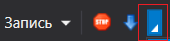
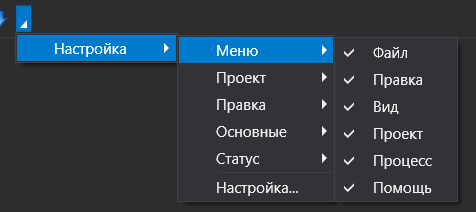
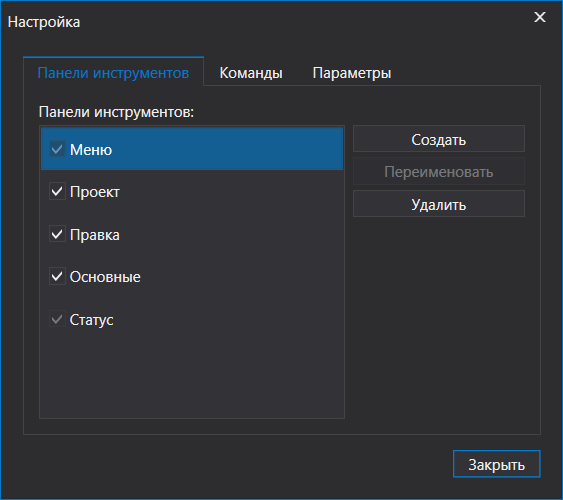
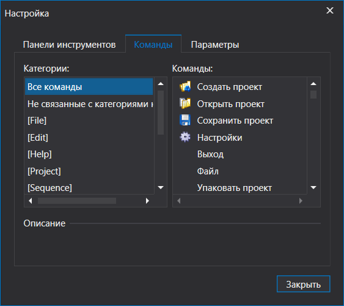
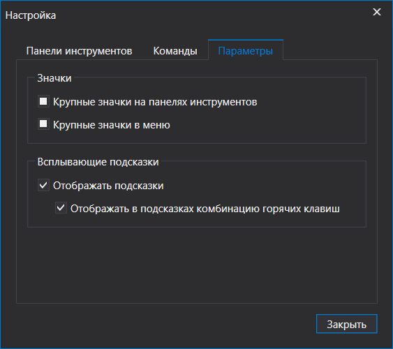

# ВЕРСИЯ ПОД WINDOWS

# Тонкая настройка

## Управление панелями

Отображение панелей студии поддается тонкой настройке. Состояния панелей сохраняются при корректном завершении работы студии. Для возвращения панелей в исходное состояние нужно нажать кнопку "Сброс панелей" меню Вид, либо закрыть студию и стереть папку Layouts по месту установки студии.

Для того, чтобы спрятать панель, нужно нажать на крестик в правой верхней части панели

Чтобы вернуть панель, нужно нажать соответствующую кнопку меню Вид.

Для управления автоматическим свертыванием панели нужно нажать кнопку с символом булавки рядом с кнопкой "крестик" 

Для перемещения панелей по экрану, нужно захватить заголовок панели и перетащить ее в нужное место.

Чтобы отцепить панель и использовать ее в качестве самостоятельного окна, нужно захватить заголовок панели и увести ее вне студии.

Аналогичные действия представлены в контекстном меню панелей (нужно нажать правой кнопкой мыши на заголовке панели).

Для группировки панелей, нужно захватить заголовок панели и перетащить ее поверх нужно панели, после чего панели будут отображены как закладки.

Для настройки отображения кнопок на панели действий и отображения разделов основного меню необходимо нажать кнопку Настройка в панели действий

В открывшемся меню можно нажать на интересующие разделы меню, чтобы скрыть их или отобразить.

Для расширенной настройки панели действий можно нажать "Настройка..."&#x20;

В открывшемся окне будут представлены настройки панелей инструментов, команд и параметров, где можно выбрать отображение кнопок на панели действий, команды, которые будут выполнять кнопки, создать новые кнопки для удобства, а также настроить отображение значков и подсказок.

