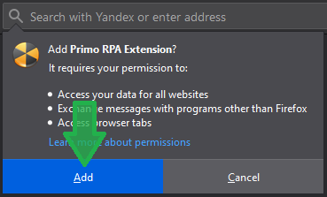
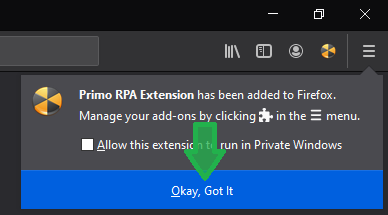

# ВЕРСИЯ ПОД WINDOWS

# FireFox

Для установки расширения для браузера FireFox необходимо:

* Находясь в Студии, перейти в раздел **Файл > Настройки > Инструменты > Расширения** и нажать на значок **FireFox**.
* Откроется браузер, а на экране появится уведомление об установке расширения:

* Нажмите кнопку **Добавить** (Add), чтобы начать установку расширения.
* Дождитесь, когда в окне браузера возникнет уведомление об успешной установке:

* Проверить, что установка произведена успешно, также можно в разделе браузера **Настройки > Расширения** (Add-ons). В перечне установленных расширений должно быть Primo RPA Extension.
