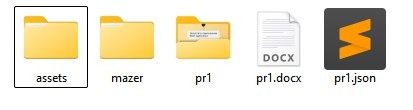
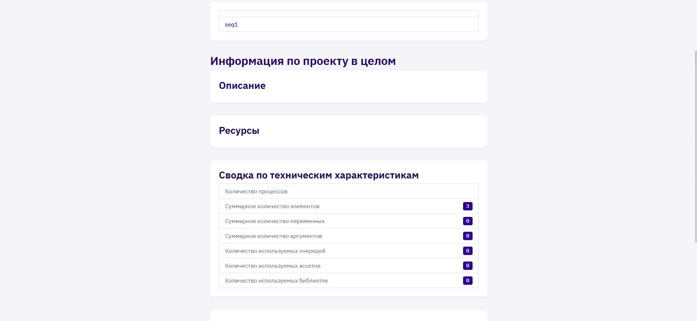

# Автодок (AutoDoc)

*AutoDoc* — это утилита командной строки, разработанная для автоматического формирования документации по проектам Primo (паспорт Робота).
С её помощью можно сгенерировать подробные отчёты по переменным, аргументам, структуре процессов и диаграммам, которые помогут в анализе и сопровождении проектов.
По умолчанию *AutoDoc* устанавливается в директорию *Plugins\AutoDoc* в папке установки **Primo RPA Studio Linux**.

## Системные требования AutoDoc

- *Операционные системы*:
  - Линукс дистрибутивы на основе Debian (протестировано на Astra Linux)
  - Линукс на пакетной базе RPM-формата (протестировано на РЕД OC)
- *Процессор*: x64, Arm64 или Arm32
- *Память*: Минимум 1 ГБ ОЗУ
- *Java Development Kit (JDK)* (необходим для использования локального рендерера)


## Основные параметры запуска

AutoDoc запускается через командную строку из папки `/opt/primo/autodoc`:

```
./PrimoAutodoc -i/-input "папка с Primo-проектом" -o/-output "папка сформированной документации" [-t/templates "папка пользовательских шаблонов"] [-word] [-local] [-oe]
```
>Также можно указывать полный путь до утилиты `/opt/primo/autodoc/PrimoAutodoc`

В квадратных скобках указываются необязательные параметры командной строки.

Описание параметров:
- *-i / -input*: Путь к процессу или к папке с проектом Primo (обязательный).
- *-o / -output*: Путь к выходной папке, в которую будет сгенерирована документация. (обязательный)
- *-t / -templates*: Путь к папке с пользовательскими шаблонами.
- *-word*: Формирование документации в формате Word. По умолчанию используется HTML.
- *-local*: Использование локального рендерера схем процессов Primo RPA.
- *-oe*: Кодировка вывода консоли. Пример: -oe 65001|| -oe utf-8. Примечание: Значением может быть идентификатор кодовой страницы или имя текущей кодировки.
- *-?*: Отобразить справку (Help)


## Описание файлов и шаблонов

Папка **Resources** содержит основные файлы и шаблоны для генерации документации. Она включает:

- **Шаблоны**: проектные файлы **project.cshtml**, **process.cshtml**, **ActivityInfo.cshtml** и файлы **Template.uml** и **Template.docx** для генерации документации.
- **Файлы настроек**: файлы `.csv`, такие как `tags.csv`, `PropertiesDict.csv`, и `elements.csv` для управления отображением наименований, типов и свойств.
- **Подпапки**: **assets* и *mazer* для стилей, скриптов и изображений, которые используются при оформлении выходных документов.

Подробное описание каждого шаблона доступно в разделе [Шаблоны AutoDoc](https://docs.primo-rpa.ru/primo-rpa/primo-rpa-studio/tools/autodoc/autodoc_templ_all).



## Конфигурация

Конфигурационный файл *appsettings.json* используется для настройки программы.

Пример содержимого файла *appsettings.json*:

```
{
  "OutputEncodingName":"utf-8",
  "Language":"ru-Ru"
}
```

- *OutputEncodingName* - определяет кодировку сообщений в консоли.
- *Language* - определяет язык сообщений консоли по умолчанию.

## Локальный рендеринг диаграмм

Для генерации диаграмм с использованием локального рендерера необходимо:
1. Установить *Java Development Kit (JDK)*.
2. Прописать переменную среды *JAVA_HOME* (желательно без пробелов в пути).
3. Убедиться, что в папке с программой есть файл *plantuml.jar*.

## Примечание

AutoDoc не имеет графического интерфейса, но можно создать *.bat* файл для удобного запуска с нужными параметрами.

AutoDoc автоматически присваивает имя итоговому файлу на основе названия проекта.
Чтобы увидеть результат, перейдите в папку, указанную в параметре `-o`, и откройте сгенерированный *.docx* (если использовался -word) или *.html* файл в соответствующей программе.

### Примеры команд

Примеры использования **AutoDoc**:

**1. Генерация документации (паспорт робота) по умолчанию.**

```
./PrimoAutodoc -i "/home/user1/Documents/Primo/main-projct/" -o "/home/user1/Documents/Primo/report/"
```
"/home/user1/Documents/Primo/main-projct/" — папка с проектом. Внутри нее находится файл project.ltp, файлы ltw и подпапки
"/home/user1/Documents/Primo/report/" — выходная папка, в ней будет создан файл Proj_main-projct.html и папка main-projct с html-документацией внутри

**2. Генерация документации (паспорт робота) с использованием пользовательского шаблона.**

```
./PrimoAutodoc -i "/home/user1/Documents/Primo/main-projct/" -o "/home/user1/Documents/Primo/report/" -t "D:/Primo/Templates"
```
"D:/Primo/Templates"— папка пользовательских шаблонов

**3. Генерация документации (паспорт робота) в формате документа MS Word.**

```
./PrimoAutodoc -i "/home/user1/Documents/Primo/main-projct/" -o "/home/user1/Documents/Primo/report/" –word
```
-word — с этим параметром создается документация в формате MS Word. Без этого параметра, документация создается по умолчанию, в формате HTML.

**4. Принудительное включение локального рендера схем процессов Primo RPA.**

```
./PrimoAutodoc -i "/home/user1/Documents/Primo/main-projct/" -o "/home/user1/Documents/Primo/report/" –local
```
-local — использовать локальный рендер схем процессов Primo RPA.
Для этого нужно:
 - установить Java Development Kit;
 - установить переменную среды JAVA_HOME (желательно чтобы путь был без пробелов);
 - убедиться, что в папке с программой есть файл "plantuml.jar" (11Mb)
По умолчанию, используется удаленный рендер схем, который требует наличия доступа в интернет.

**5. Изменение текстовой кодировки вывода консоли.**

```
./PrimoAutodoc -i "/home/user1/Documents/Primo/main-projct/" -o "/home/user1/Documents/Primo/report/" -oe "utf-8"
```
"utf-8" — значение устанавливаемой кодировки. В качестве значения может быть строка с именем кодировки или числовой идентификатор кодовой страницы, например, 65001. Кодировку по умолчанию можно так же задать в настройках приложения.

**6. Получить справку.**

```
./PrimoAutodoc -?
```

Пример паспорта робота:

   
