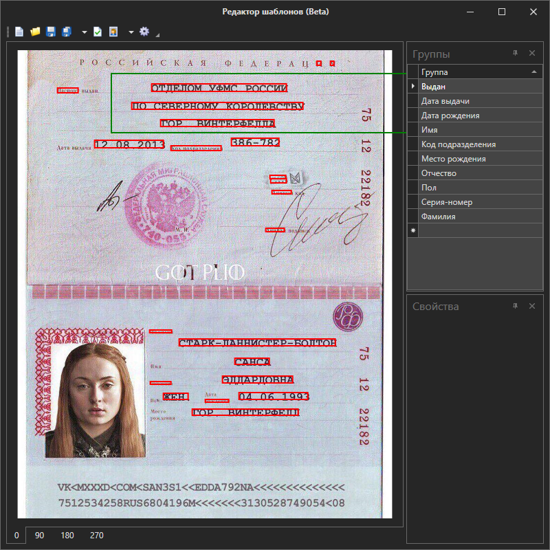
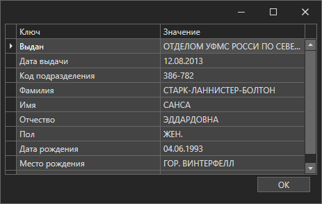
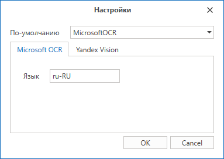
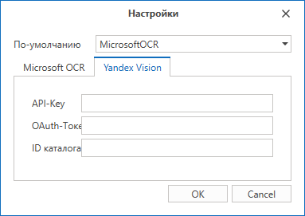

# ВЕРСИЯ ПОД WINDOWS

# Редактор шаблонов OCR

Редактор шаблонов OCR является плагином Студии и служит для разработки шаблонов чтения отсканированных документов. Для вызова редактора необходимо перейти в раздел меню **Инструменты ➝ Редактор шаблонов OCR**. На данный момент редактор поддерживает OCR компании Microsoft (встроен в ОС Windows, начиная с версии 8) и Yandex Vision. Этот инструмент еще молод и будет совершенствоваться по мере получения обратной связи от пользователей.&#x20;

Редактор состоит из следующих частей:

* Главное меню
* Распознанный образ шаблонного документа
* Закладки переключения между поворотами шаблонного документа
* Группы текста
* Свойства

В главном меню находятся кнопки для работы с шаблонами (Создать шаблон, Открыть шаблон, Сохранить шаблон и т.д.).

Для создания нового шаблона нажмите кнопку **Создать шаблон**, после чего выберите файл с отсканированным эталонным документом. Данный файл будет распознан средствами OCR: в нем будут выделены текстовые блоки (помечены красными прямоугольниками) и полученное изображение вместе с блоками будет выведено на экран.

При работе с распознаваемыми документами основными сущностями являются: якорь и группа. Якорь - это текстовый блок, являющийся точкой отсчета при поиске групп текста (сверху, снизу, слева, справа от якоря). Группа - сгруппированные текстовые блоки, образующие полезные данные. Группа располагается в однозначной позиции относительно выбранных якорей либо находится в заданных координатах (пропорционально размерам изображения).

Для работы со свойствами текстовых блоков кликните мышью на красный прямоугольник нужного блока. Каждый найденный блок имеет следующие свойства:

* **Наименование** - является мнемоническим и используется при дальнейшей разработке шаблона.
* **Текст** - является базисом при поиске якорей в распознаваемых документах.
* **Якорь** - определяет, можно ли расценивать данный блок в качестве якоря.
* **Регистр** - определяет, нужно ли учитывать регистр текста при поиске якоря.
* **Пробелы** - определяет, нужно ли учитывать пробелы в тексте при поиске якоря.
* **Регулярное выражение (Match)** - позволяет ввести текст регулярного выражения, который будет использоваться во время сравнения текстов при поиске якоря.
* **Регулярное выражение (Replace)** - то же, что и выше.
* **Fuzzy** - определяет, нужно ли использовать нечеткую логику при сравнении текстов во время поиска якоря. Якоря могут находиться на разных поворотах документа, поэтому имеет смысл пройтись по всем закладкам поворота (0, 90, 180, 270).

После первичного распознавания шаблона необходимо определить блоки-якоря (при помощи свойства **Якорь**) и в остальных свойствах ввести значения, необходимые для поиска якоря в документах, которые будут распознаваться по данному шаблону. После определения якорей необходимо создать **Группы текста** - для этого в панели групп кликните в пустой строке и введите название новой группы. Текстовые блоки попадают в группу только в случае, если они полностью находятся в области координат поиска.   

Каждая группа имеет следующие свойства:

* **Наименование** - является мнемоническим и используется при работе с документами из элемента [**Распознать форму**](https://docs.primo-rpa.ru/primo-rpa/g_elements/osnovnye-elementy/els_ocr/ocr_form_recog).
* **Поворот** - определяет, на каком из поворотов документа искать данную группу (0, 90, 180, 270).
* **Координаты** - определяет, в какой области документа искать данную группу (% относительно размеров документа).
* **Якорь** - определяет, какие якоря использовать при поиске данной группы. Обязательно для заполнения. Всего таких якорей четыре: левый, правый, нижний и верхний. Каждый обладает свойствами:
     * *Наименование* - название якоря, используемого в данном поиске.
     * Свойства *Сверху*, *Слева*, *Снизу*, *Справа* - определяют сдвиги начала и конца области поиска относительно якоря. Значение задается в % относительно размеров блока якоря.&#x20;

Если Вы используете свойство **Координаты**, важно помнить, что рамки и размеры обрабатываемых документов должны быть идентичны эталонному документу. Обрезание частей либо дополнительные пустые области в отсканированном изображении недопустимы. Также важно помнить, что технология OCR работает только с документами хорошего качества и высокого разрешения. В комплекте со Студией поставляется несколько шаблонов распознавания. Эти шаблоны не являются окончательными и требуют донастройки под используемые у Вас форматы сканирования.

Чтобы протестировать шаблон, нужно нажать в меню редактора кнопку **Протестировать шаблон** либо кнопку **Протестировать изображение**. После тестирования на экране отобразятся результаты обработки изображения по шаблону.

Тестирование шаблона отличается от тестирования изображения тем, что в случае шаблона тестируется изображение, прикрепленное к шаблону, а в случае изображения необходимо выбрать файл для тестирования.

Созданный шаблон необходимо сохранить на диск. После этого его можно будет использовать в элементе [**Распознать форму**](https://docs.primo-rpa.ru/primo-rpa/g_elements/osnovnye-elementy/els_ocr/ocr_form_recog).

Для настройки OCR выберите в редакторе пункт меню **Настройки**. В открывшемся окне доступны следующие свойства:

Для Microsoft OCR:

* **Язык** - определяет язык документа.

Для Yandex Vision:

* **API-Key** - ключ API сервиса.
* **OAuth-Токен** - токен сервиса.
* **ID каталога** - ID каталога сервиса.

Выбранный язык OCR должен быть установлен в операционной системе (см. описание элемента [Microsoft OCR](../../g\_elements/el\_basic/els\_ocr/el\_ocr\_microsoft.md)).
