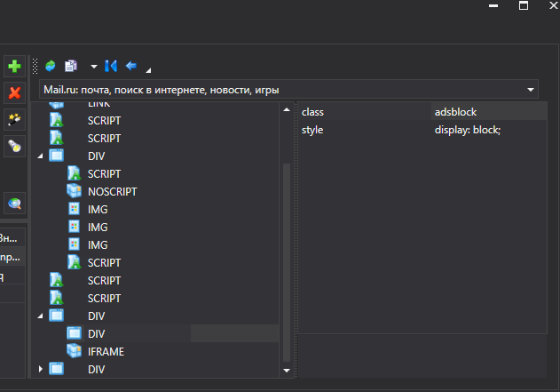

# ВЕРСИЯ ПОД WINDOWS

# Инспектор UI

Для исследования структуры интерфейсов приложений (веб- и десктопных на Windows), в Primo Studio существует инструмент **Инспектор UI**.

Для начала работы требуется нажать кнопку **Обновить дерево** .

Рассмотрим интерфейс инспектора на примере работы с десктопным приложением. После команды **Обновить дерево** инспектор начнет исследовать все запущенные приложения и отобразит структуру каждого, обладающего графическим интерфейсом. В левой части панели отобразится дерево контроллов:

При выборе контролла, в правой части будут отображены сведения о его атрибутах:

Данную информацию удобно использовать при построении шаблонов для поиска компонентов приложений рабочего стола.

Похожим образом инспектор исследует структуру веб-приложения:

При помощи кнопок  и  происходит перенос выбранных элементов в шаблон.

### Функции

Кнопка  - обновляет дерево приложений.

Кнопка  - в десктопных приложениях производит обновление информации о контроллах с задержкой в 10 секунд. Функция полезна для захвата главного и контекстного меню приложений.

Кнопка  - копирует шаблон поиска выбранного элемента в буфер обмена.

Кнопка  - добавляет новую строку поиска в текущий шаблон.

Кнопка  - переносит выбранный атрибут в текущий шаблон поиска.

Кнопка  - производит поиск введенной информации в дереве компонентов, начиная с выделенного элемента.
