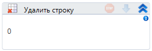

# Удалить строку

Компонент, удаляющий строку таблицы.

| Свойство  | Тип                   | Описание              |
| --------- | --------------------- | --------------------- |
| Индекс\*  | Int32                 | Индекс строки         |
| Таблица\* | System.Data.DataTable | Редактируемая таблица |
