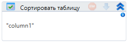

# Сортировать таблицу

Компонент, сортирующий таблицу.

| Свойство      | Тип                   | Описание               |
| ------------- | --------------------- | ---------------------- |
| Колонка\*     | String                | Сортируемая колонка    |
| Таблица\*     | System.Data.DataTable | Сортируемая таблица    |
| Направление\* |                       | Направление сортировки |
| Результат\*   | System.Data.DataTable | Созданная таблица      |
