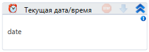

# Текущая дата/время

Компонент, получающий текущие дату и время.

| Свойство    | Тип      | Описание             |
| ----------- | -------- | -------------------- |
| Результат\* | DateTime | Текущие дата и время |
