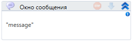

# Окно сообщения



Компонент, производящий отображение окна с заданным сообщением.

Для корректной работы компонента необходимо в настройках Студии установить чекбокс "Наличие UI".

## Свойства

1. **Текст\*** *[String]* - Отображаемое сообщение



```csharp
LTools.Workflow.PrimoApp.MessageBox(wf, "text");
```



```python
LTools.Workflow.PrimoApp.MessageBox(wf, "text")
```



```javascript
_lib.LTools.Workflow.PrimoApp.MessageBox(wf, "text");
```


