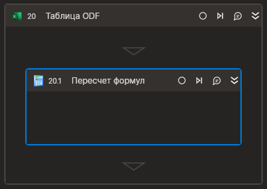

# Пересчет формул

Компонент, пересчитывающий формулы листов Excel.

## Только код
Пример использования элемента в процессе с типом Только код (Pure code):  

**C#**  
`Primo.Office.OdfOxml.ExcelApp app = Primo.Office.OdfOxml.ExcelApp.Init(wf, [file]);`  
`app.Calculate();`
