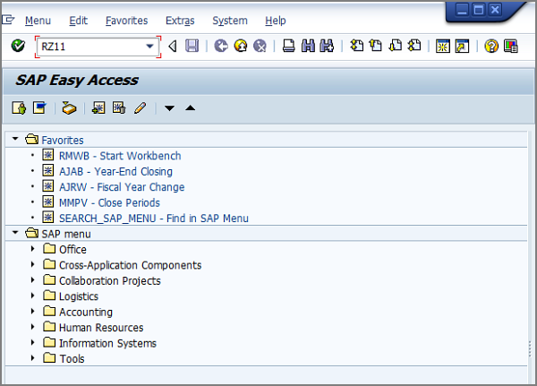
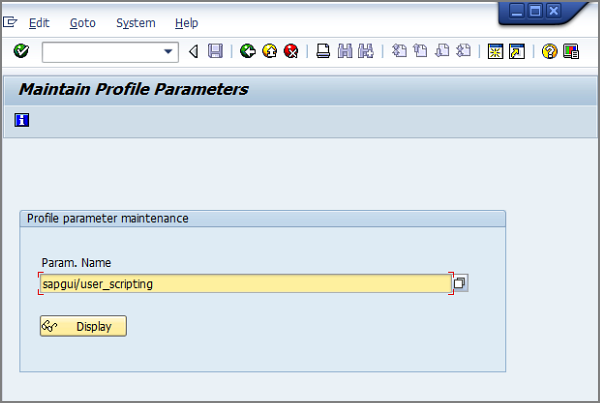
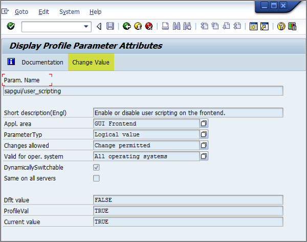
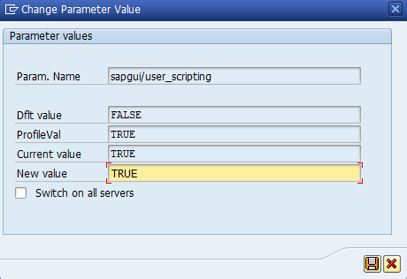
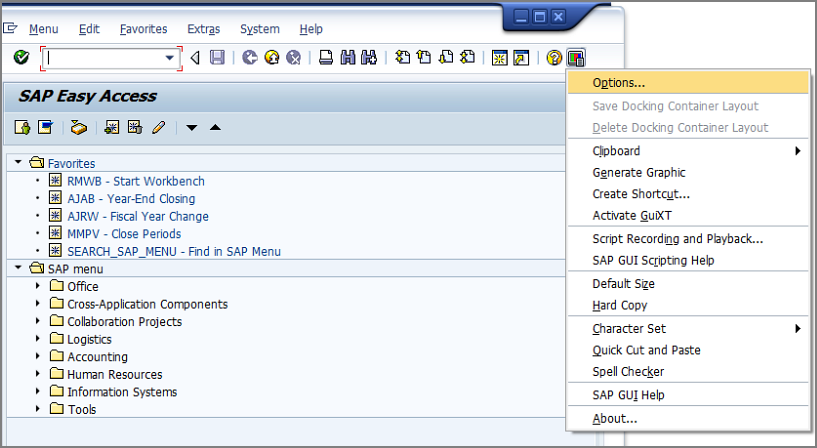
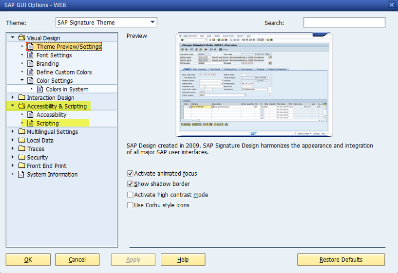
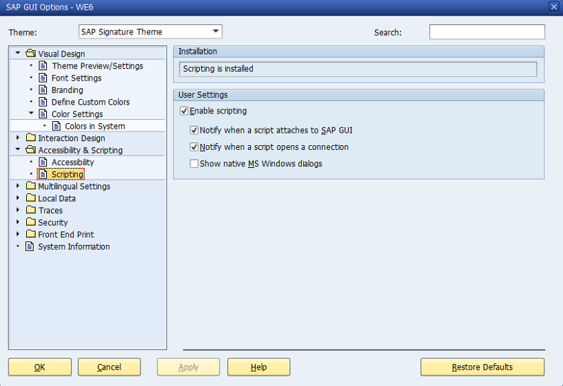

# SAP Front End

Для работы компонентов SAP Front End (за исключением BAPI), необходимо включить поддержку SAP UI Scripting.

**Активация SAP UI Scripting**

В SAP UI перейти в транзакцию RZ11

В поле Param. Name ввести sapgui/user\_scripting

Нажать Change Value

В поле New Value ввести TRUE и нажать кнопку с дискетой

**Перезагрузить SAP UI**

Далее в SAP UI нажать кнопку Customize Local Layout и выбрать Options

Перейти в раздел Accessibility & Scripting и выбрать Scripting

Поставить галку в пункте Enable scripting и убрать галки в пунктах Notify...

