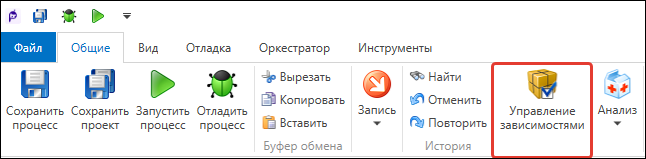
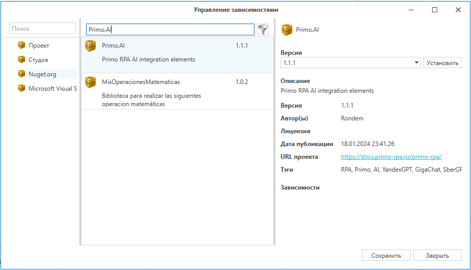
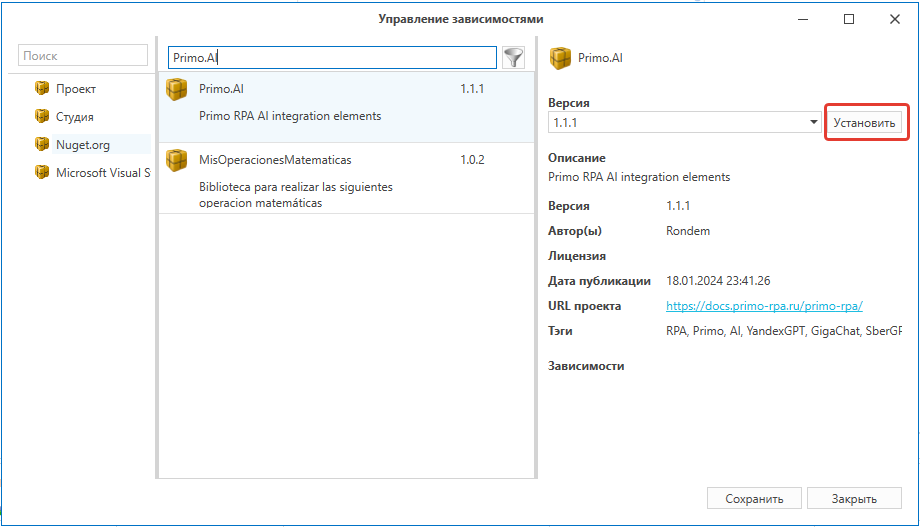
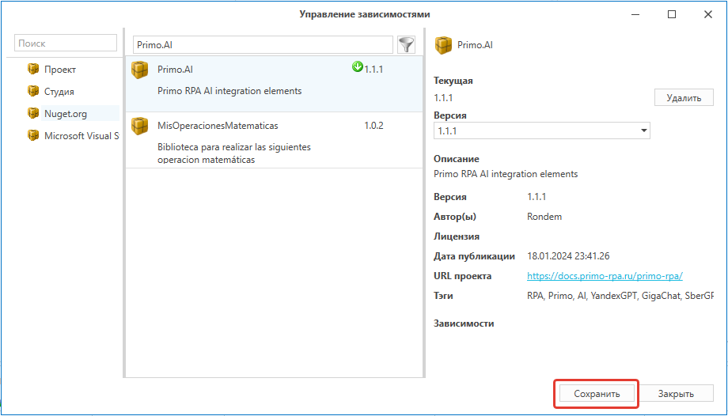
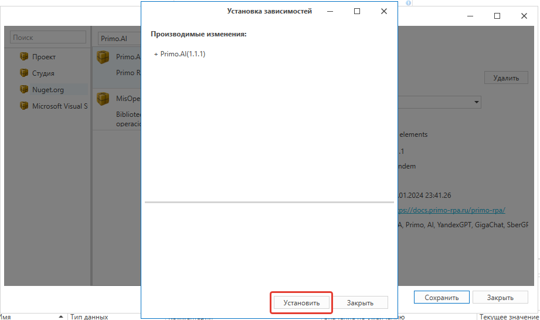
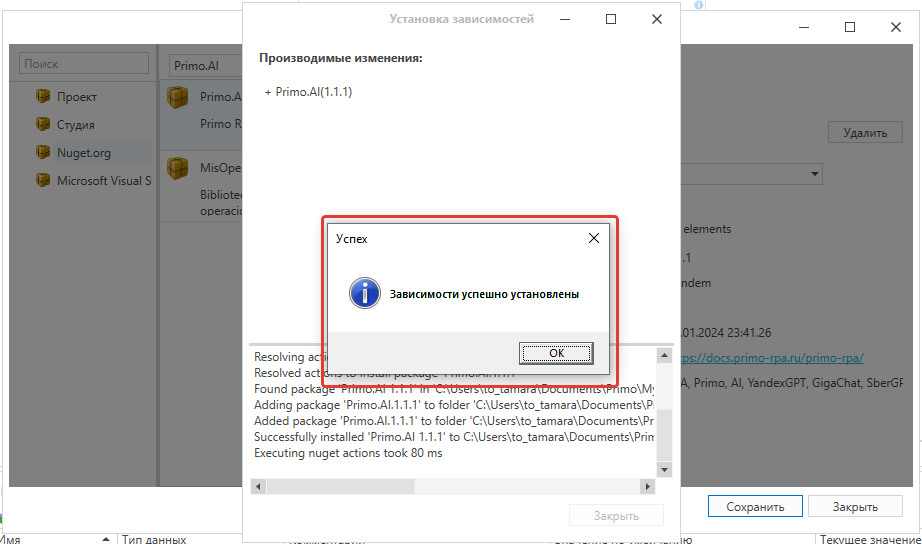
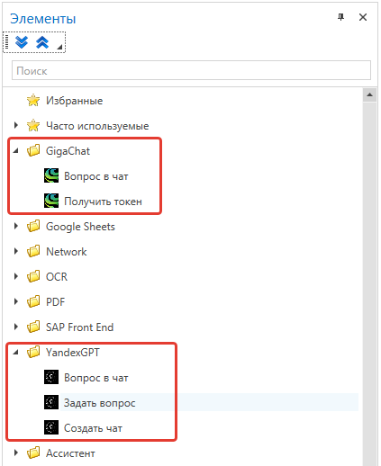

# AI

Библиотека **Primo.AI** позволяет автоматизировать работу с генеративными языковыми моделями. На данный момент поддерживается работа с Sber GigaChat и Yandex YandexGPT.

Библиотека содержит следующие элементы:

1. GigaChat:
   * [**Получить токен**](https://docs.primo-rpa.ru/primo-rpa/g_elements/el_extra/ai/gigachat/el_gettoken) — получает токен GigaChat.
   * [**Вопрос в чат**](https://docs.primo-rpa.ru/primo-rpa/g_elements/el_extra/ai/gigachat/el_chatmessage) — отправляет указанный вопрос в GigaChat.
2. YandexGPT:
   * [**Создать чат**](https://docs.primo-rpa.ru/primo-rpa/g_elements/el_extra/ai/yandexgpt/el_chat) — создает чат с YandexGPT.
   * [**Вопрос в чат**](https://docs.primo-rpa.ru/primo-rpa/g_elements/el_extra/ai/yandexgpt/el_chatmessage) — отправляет вопрос в чат с YandexGPT. Используйте этот элемент, если вам необходимо поддерживать диалог чат-бота и отправлять запросы в синхронном режиме.
   * [**Задать вопрос**](https://docs.primo-rpa.ru/primo-rpa/g_elements/el_extra/ai/yandexgpt/el_instruct) — задает вопрос YandexGPT. Используйте этот элемент, если ваш вопрос не требует срочного ответа и, следовательно, можно отправить запрос в асинхронном режиме. В асинхронном режиме генерация текста займет больше времени, но ответ будет качественнее и дешевле.

## Установка Primo.AI

Ниже описан пошаговый способ установки **Primo.AI** в качестве зависимости проекта:

1. Откройте Primo RPA Studio и нажмите в главном меню кнопку **Управление зависимостями** 

   

2. В окне **Управление зависимостями** перейдите на вкладку **Nuget.org**. Введите в поисковом поле название пакета — **Primo.AI**.

   

3. Установите пакет:
   * Нажмите кнопку **Установить**.

   

   * Нажмите кнопку **Сохранить**.

   

   * Нажмите кнопку **Установить**.

    

    * Дождитесь окончания установки и нажмите **ОК**.

    
 
4. Готово — пакет **Primo.AI** установлен в качестве зависимости. Немного подождите, пока зависимость загрузится. Во время установки проект будет перезапущен с предложением сохранить изменения.

5. Перейдите на панель элементов и найдите появившиеся группы `GigaChat` и `YandexGPT`.

   

6. Перетащите элемент из нужной группы в процесс, чтобы начать с ним работу.

