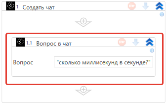
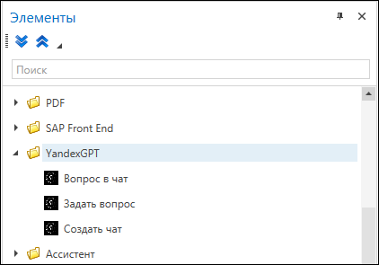
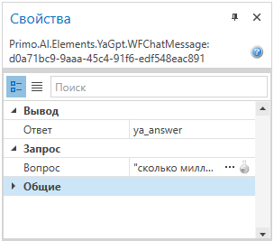

# Вопрос в чат

Отправляет вопрос в чат с YandexGPT. Используйте этот элемент, если вам необходимо поддерживать диалог с чат-ботом и отправлять запросы в синхронном режиме.

Элемент **Вопрос в чат** должен размещаться в контейнере **Создать чат**. Убедитесь, что в контейнере указан действующий токен для запросов.

Элементы группы YandexGPT, включая **Вопрос в чат**, становятся доступными после установки в Студии библиотеки **Primo.AI**:

## Предварительные условия

Должен быть [создан и настроен чат](https://docs.primo-rpa.ru/primo-rpa/g_elements/el_extra/ai/yandexgpt/el_chat) с YandexGPT.

## Свойства
Символ `*` в названии свойства указывает на обязательность заполнения. Описание общих свойств см. в разделе [Свойства элемента](https://docs.primo-rpa.ru/primo-rpa/primo-studio/process/elements#svoistva-elementa).

**Запрос**:

* **Вопрос\*** *[String]* — текст вашего вопроса.

**Вывод**:

* **Ответ** *[String]* — переменная для хранения ответа бота. 

Пример заполнения свойств:

