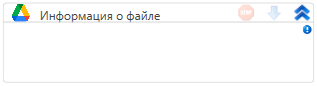

# Информация о файле

Элемент, получающий информацию о файле

| Свойство   | Тип                            | Описание                           |
| ---------- | ------------------------------ | ---------------------------------- |
| ID файла   | String                         | ID файла                           |
| Общий диск |                                | Поддержка общих дисков             |
| Информация | Google.Apis.Drive.v3.Data.File | Переменная для хранения информации |
