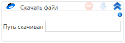

# Скачать файл

Элемент, производящий скачивание файла

| Свойство        | Тип    | Описание                                 |
| --------------- | ------ | ---------------------------------------- |
| Путь скачивания | String | Путь скачивания файла                    |
| Путь к файлу    | String | Путь к скачиваемому файлу (/folder/file) |
| Буфер           | Int32  | Размер буфера                            |
