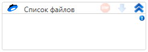

# Список файлов

Элемент, получающий список файлов.

| Свойство      | Тип                                          | Описание                  |
| ------------- | -------------------------------------------- | ------------------------- |
| Лимит         | Int32                                        | Лимит чтения файлов       |
| Смещение      | Int32                                        | Смещение файлового чтения |
| Список файлов | List\<Primo.LabVS.YandexDisk.Model.FileInfo> | Список полученных файлов  |
