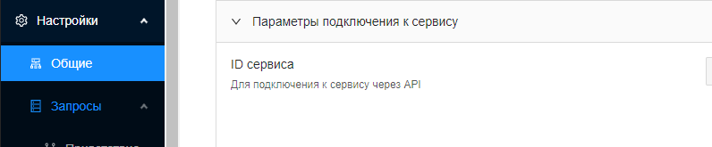
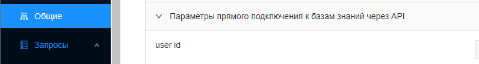

# AutoFAQ

Для работы с AutoFAQ необходимо провести следующие настройки:

1. Выяснить URL, логин и пароль вашего портала AutoFAQ. Обычно, URL имеет вид [https://\*.autofaq.ai/](https://croc-chat.autofaq.ai/)
2. Найти ID сервиса. Для этого перейдите в раздел Настройки -> Общие -> Параметры подключения к сервису

3\. Выяснить ID пользователя. Для этого перейдите в раздел Настройки -> Общие -> Параметры прямого подключения к базам знаний через API

