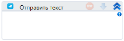

# Отправить текст

Элемент, отправляющий текстовое сообщение в чат Telegram.

| Свойство              | Тип                                      | Описание                              |
| --------------------- | ---------------------------------------- | ------------------------------------- |
| Соединение с Telegram | Primo.Messaging.TelegramMsg. TelegramSvc | Соединение с Telegram                 |
| Текст\*               | String                                   | Текст сообщения                       |
| Ответ на сообщение    | Int32                                    | ID сообщения на которое надо ответить |
| ID чата\*             | String                                   | ID чата                               |

