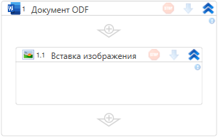

# Вставка изображения

Элемент вставляет изображение в ODF-файл. Путь до файла указывается в контейнере «Документ ODF».

## Свойства

Описание общих свойств см. в разделе [Свойства элемента](https://docs.primo-rpa.ru/primo-rpa/primo-studio/process/elements#svoistva-elementa).

1. **Изображение**\* *[byte[]]]* — изображение для вставки.  
2. **Позиция** *[Int32]* — позиция для вставки изображения. 
3. **Закладка** *[String]* — название закладки, определяющей начало записи. Если не указано, запись производится в конец текста.

