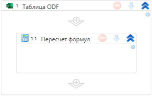

# Пересчет формул

Элемент пересчитывает формулы на листах ODF-файла. Путь до файла указывается в контейнере «Таблица ODF».

## Свойства

Описание общих свойств см. в разделе [Свойства элемента](https://docs.primo-rpa.ru/primo-rpa/primo-studio/process/elements#svoistva-elementa).

Специальных свойств данный элемент не имеет.
