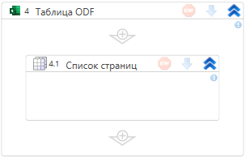

# Список страниц

Элемент получает список страниц ODF-документа. Результат сохраняется в переменную.

Путь до файла указывается в контейнере «Таблица ODF».

## Свойства

Символ `*` указывает на обязательность заполнения свойства. Описание общих свойств см. в разделе [Свойства элемента](https://docs.primo-rpa.ru/primo-rpa/primo-studio/process/elements#svoistva-elementa).

1. **Переменная** *[List\<string\>]* — название переменной, в которую запишется список страниц.
