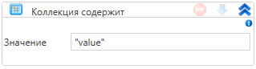

# Коллекция содержит

Элемент, проверяющий наличие элемента в коллекции

| Свойство   | Тип                      | Описание              |
| ---------- | ------------------------ | --------------------- |
| Переменная | bool                     | Результат проверки    |
| Значение   | T                        | Искомое значение      |
| Коллекция  | System.Collections.IList | Исследуемая коллекция |
