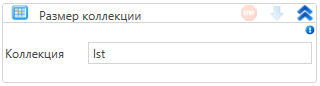

# Размер коллекции

Элемент, получающий размер коллекции

| Свойство   | Тип                      | Описание                         |
| ---------- | ------------------------ | -------------------------------- |
| Переменная | Int32                    | Переменная для храния результата |
| Коллекция  | System.Collections.IList | Исследуемая коллекция            |

