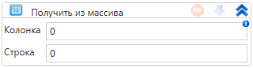

# Получить из массива

Элемент, получающий значение из массива по индексам колонки и строки

| Свойство   | Тип          | Описание                             |
| ---------- | ------------ | ------------------------------------ |
| Колонка    | Int32        | Номер колонки                        |
| Строка     | Int32        | Номер строки                         |
| Переменная | T            | Переменная для сохранения результата |
| Коллекция  | System.Array | Обрабатываемый массив                |
