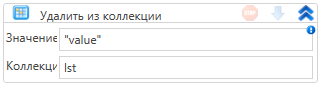

# Удалить из коллекции

Элемент, удаляющий значение из коллекции

| Свойство  | Тип                      | Описание                 |
| --------- | ------------------------ | ------------------------ |
| Значение  | T                        | Удаляемое значение       |
| Коллекция | System.Collections.IList | Обрабатываемая коллекция |

