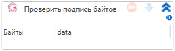

# Проверить подпись байтов

Элемент, проверяющий ЭЦП массива байт

| Свойство                        | Тип     | Описание                        |
| ------------------------------- | ------- | ------------------------------- |
| Подписанное сообщение           | byte\[] | Подписанное сообщение           |
| Подпись байтов                  | byte\[] | Подпись байтов                  |
| Проверить отсоединенную подпись |         | Проверить отсоединенную подпись |

