# Начало работы

После успешного запуска на экране появится окно приветствия:

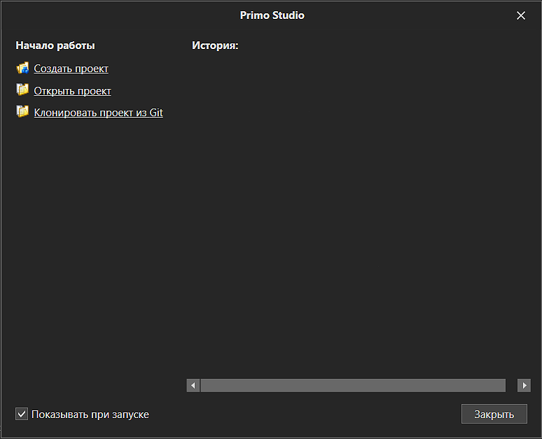

Из данного окна можно создать новый проект, открыть имеющийся, либо выбрать один из последних проектов, с которыми производилась работа - они отобразятся в блоке "История". 

Если снять галку "Показывать при запуске", данное окно более не будет появляться. После закрытия окна приветствия, станет доступно окно Студии:

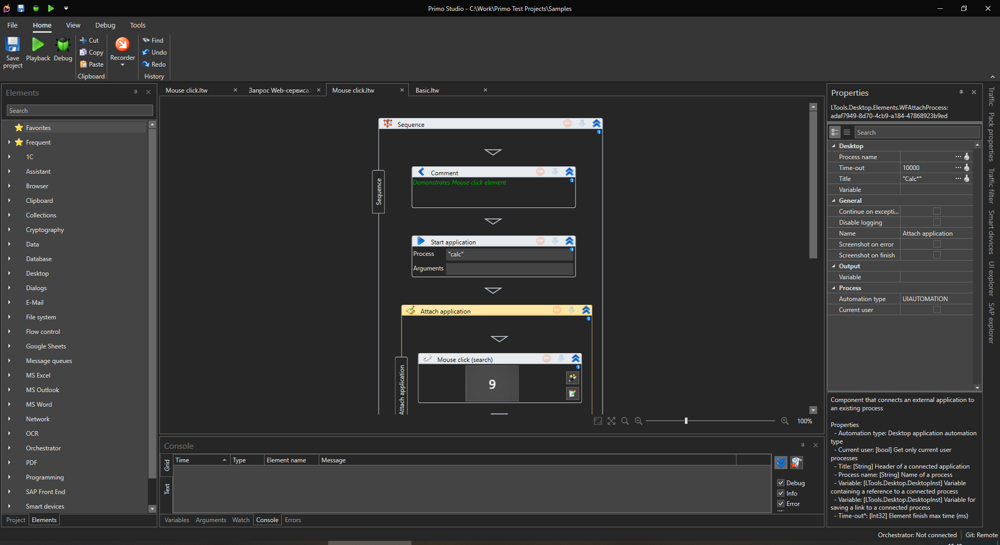

В окне присутствуют следующие компоненты:&#x20;

Главное меню приложения (Файл):

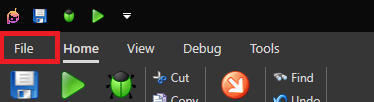

В данном меню имеются следующие пункты:

Проект

* Создать проект
* Открыть проект
* Недавние
* Закрыть проект

Групповая работа

* Загрузить изменения
* Отменить изменения
* Сохранить изменения
* Управление версиями
* Ветви
* Отсоединить
* Удаленные репозитории

Экспорт

* Упаковать проект

Настройки

О программе&#x20;

* Руководство пользователя

Выход

Основная панель представляет собой ленту, разбитую на следующие группы:

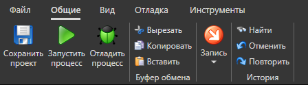

Общие

* Сохранить проект
* Запустить процесс
* Отладить процесс
* Вырезать
* Копировать
* Вставить
* Запись
* Найти
* Отменить
* Повторить

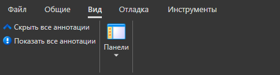

Вид

* Сохранить все аннотации
* Показать все аннотации
* Панели

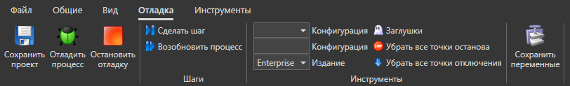

Отладка

* Сохранить проект
* Отладить процесс
* Остановить отладку
* Сделать шаг
* Возобновить процесс
* Конфигурация запуска
* Издание робота
* Заглушки
* Убрать все точки останова текущего процесса
* Убрать все точки отключения текущего процесса
* Сохранить переменные

Панель проекта:

В данной панели имеются кнопки:

* Создать папку
* Редактировать элемент
* Добавить файл
* Удалить элемент
* Создать процесс

Панель элементов

​

Основная рабочая область

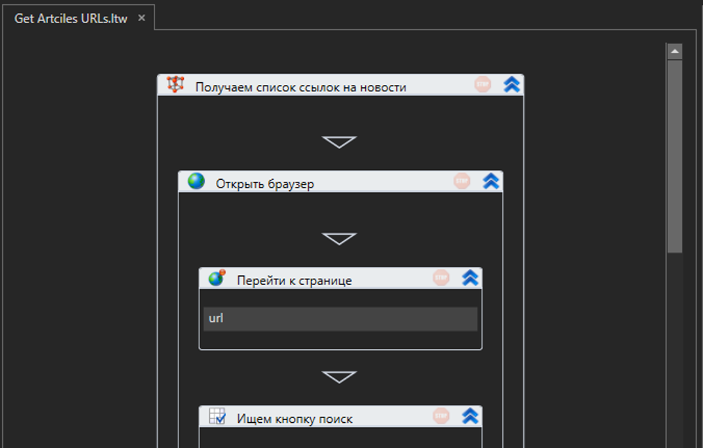

​

Панель свойств

​

Панель перехвата трафика

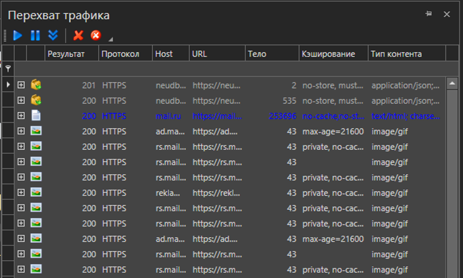

​

Панель свойств пакета

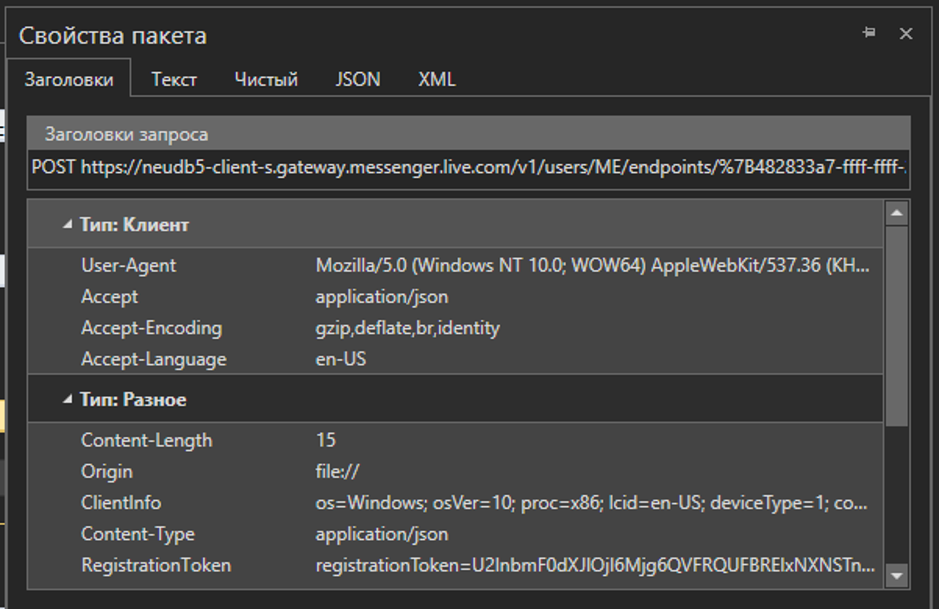

​

Панель фильтра трафика

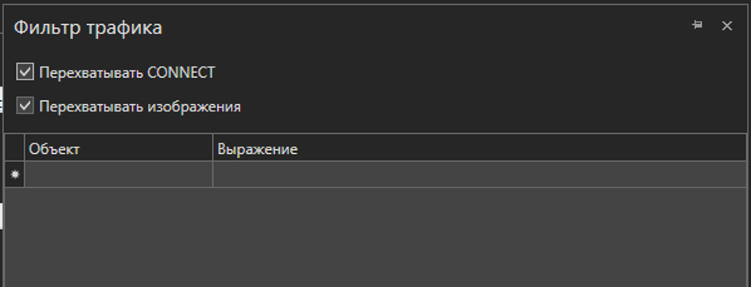

​

Панель мобильных устройств

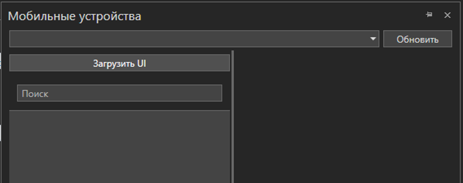

​

Панель инспектора UI

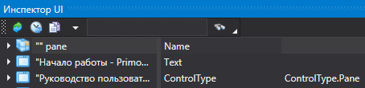

​

Панель инспектора SAP

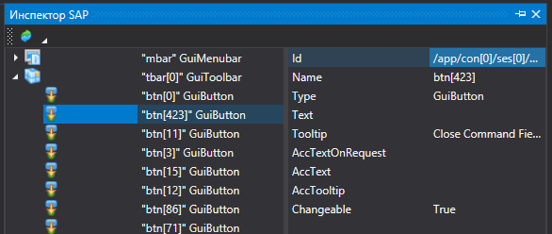
