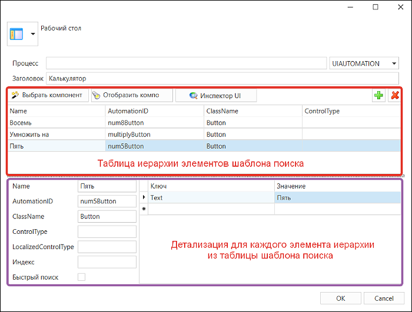
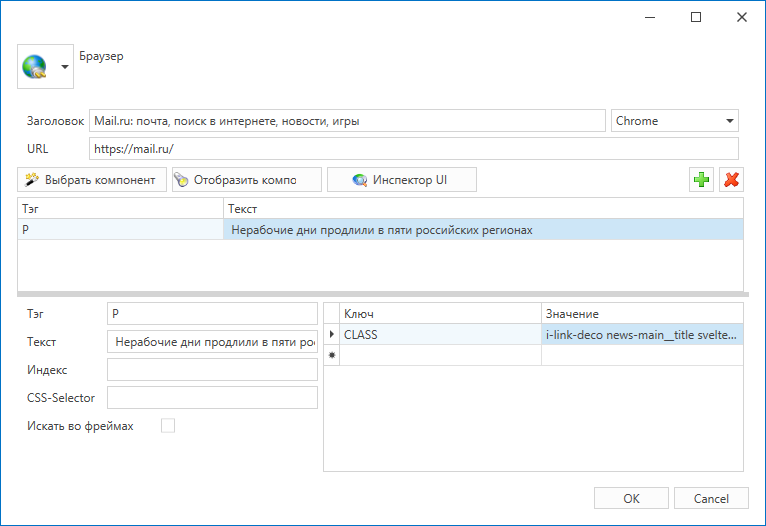
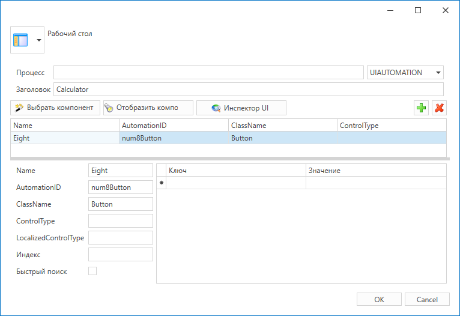
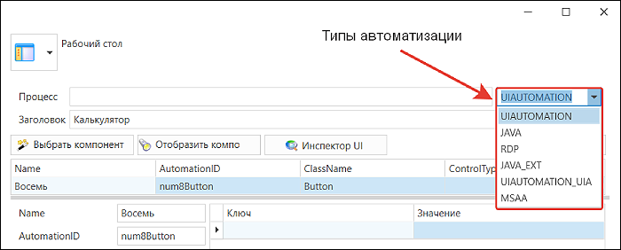
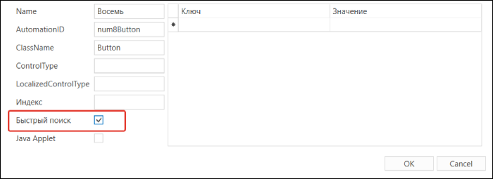
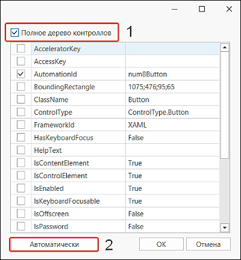
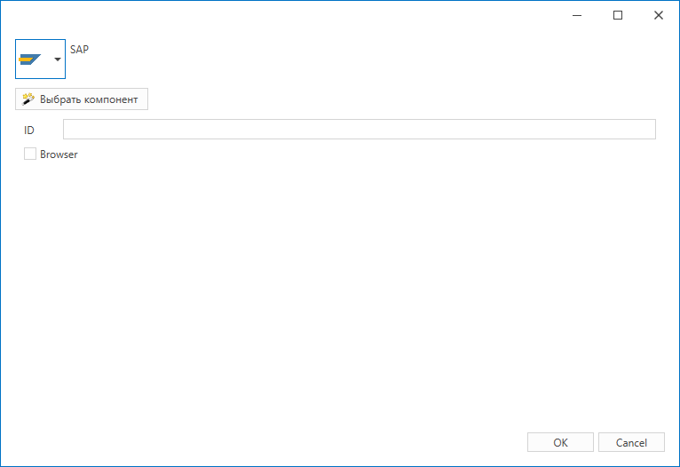
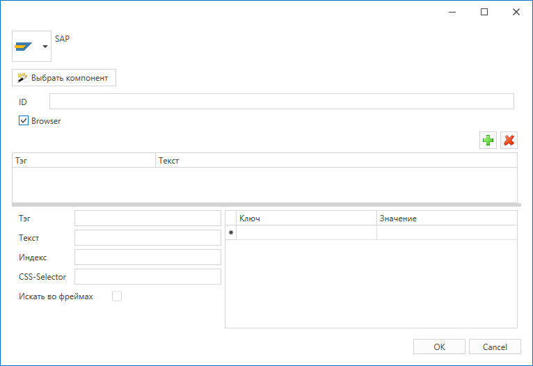

# Категории приложений

Статья содержит инструкцию по работе с редактором шаблона поиска в различных категориях приложений. Общая информация о шаблоне поиска приведена [здесь](https://docs.primo-rpa.ru/primo-rpa/primo-studio/process/searchpatterns).

При добавлении в шаблон нескольких компонентов, каждую строку с компонентом можно детализировать в таблице ниже:

В шаблонах возможно использовать имена переменных в формате {переменная}. Если вы прописываете переменную, то робот во время работы будет менять переменную на нужное значение. Вызов переменной может быть прописан прямо в JSON.

Также в значениях полей допустимо использовать символ `*`.

**ВНИМАНИЕ!** В окне редактора для всех режимов, кроме SAP, доступен инструмент **Инспектор UI**, который позволяет детально исследовать интерфейсы приложений. Работа с инструментом подробнее описана в разделе [**Инспектор UI**](https://docs.primo-rpa.ru/primo-rpa/primo-studio/instrumenty/uiexplorer).

## Браузер 

Шаблон поиска для категории приложений **Браузер** выглядит следующим образом:

В поле **Заголовок** укажите название сайта, в котором нужно найти компонент. В поле **URL** задайте адрес сайта.\
Не забудьте выбрать тип браузера в параметре рядом с полем **Заголовок**. На рисунке выше выбран браузер Chrome.

Для добавления компонента вручную:

1. Нажмите кнопку , после чего выделите новую строку и введите данные в поля **Тэг, Текст, Индекс** (начинается с единицы) и **Искать во фреймах** (поиск внутри элементов iframe).
2. Для уточнения поиска можно ввести имена и значения атрибутов тега в таблицу (ключ, значение). Если указать несколько строк, поиск элемента в браузере будет вестись вглубь от самого верхнего шаблона.

Для автоматического добавления компонента нажмите кнопку **Выбрать компонент**  и в нужном окне браузера кликните искомый компонент. Также можно использовать кнопку быстрого добавления на самом элементе.

## Рабочий стол 

Шаблон поиска для приложений **Рабочего стола** выглядит следующим образом:

Чтобы присоединиться к нужному приложению, достаточно заполнить одно из полей:

* **Заголовок** — имя главного окна десктоп-приложения.\
  :bangbang: _**Важно.**_ Если заголовок содержит спецсимвол `\`, его потребуется заэкранировать. Примеры:\
  :white\_medium\_small\_square:`С:\\Users\\User1\\AppData\\Local\\Primo.Exchange\\ext.chrome - Notepad++`;\
  :white\_medium\_small\_square: `*\\cmd.exe`.
* **Процесс** — название процесса запущенного приложения Windows.

Если заполнены оба поля, будут одновременно учитываться оба значения.

В верхнем правом углу находится параметр с типами [автоматизации пользовательского интерфейса](https://learn.microsoft.com/ru-ru/dotnet/framework/ui-automation/ui-automation-overview):

Технология автоматизации обеспечивает программный доступ к элементам пользовательского интерфейса приложения. Доступны следующие типы:

* **UIAUTOMATION** — значение по умолчанию. Подходит для приложений рабочего стола, работающих по правилам Win32.
* **UIAUTOMATION\_UIA** — рекомендуется использовать в случае, если в режиме UIAUTOMATION не удается получить доступ к нужному элементу управления. Более старая технология.\
  :small_blue_diamond: ***Примечание***. ***Если сначала был выбран режим UIAUTOMATION_UIA, а потом — UIAUTOMATION, то для корректной работы шаблона поиска потребуется перезагрузить Студию.***
* **MSAA** — библиотека Microsoft Active Accessibility. Имеет больше ограничений, чем UIAUTOMATION, т.к. является устаревшей технологией. Обращение к MSAA будет полезным в ограниченном количество случаев: например, когда при поиске текстовых элементов необходимо использовать свойство идентификации **Role**.
* **JAVA** и **JAVA\_EXT** — предназначены для Java-приложений. Тип Java использует расширение Primo, тип Java\_Ext — расширения сторонних вендоров.\
  :bangbang: _**При работе с Java, разрядность Студии и Робота должны совпадать с разрядностью Java.**_ :bangbang:
* **RDP** — используется для работы с приложениями удаленного рабочего стола [по протоколу RDP](https://docs.primo-rpa.ru/primo-rpa/primo-studio/instrumenty/rdp).

Для добавления компонента вручную:

1. Нажмите кнопку , выделите новую строку и введите данные в поля **AutomationID, Name, ClassName, ControlType, LocalizedControlType** и **Индекс** (начинается с единицы). Поля заполняются выборочно. При этом свойство **AutomationID** является одним из самых важных при поиске: оно не изменяется при каждом запуске и однозначно идентифицирует компонент.
2. Для уточнения поиска можно ввести имена и значения атрибутов искомого компонента в таблицу (ключ, значение). Если указать несколько строк, поиск элемента в роботизируемом приложении будет вестись вглубь от самого верхнего шаблона.

Функция **Быстрый поиск** включена по умолчанию и активирует укороченный маршрут поиска компонента в приложении. Рекомендуется использовать этот параметр при работе с 1С.\
Быстрый поиск не поддерживает поиск по свойствам идентификации BoundingRectangle, AcceleratorKey, ProcessId, NativeWindowHandle, Orientation. Если в режиме быстрого поиска компонент не находится, отключите параметр и произведите поиск еще раз.

Для автоматического добавления компонента используйте опцию **Выбрать компонент**  и кликните искомый элемент в окне нужного приложения. Откроется окно для выбора свойств компонента (дерево контроллов). В случае, если необходим обход всего дерева свойств, воспользуйтесь кнопкой **Автоматически** с установленным чекбоксом **Полное дерево контроллов**:

## SAP 

При работе с SAP рекомендуется использовать специализированные компоненты.

Шаблон поиска для категории **SAP** выглядит следующим образом:

Если происходит работа с WebView SAP, шаблон поиска будет иметь следующий вид:

Область Browser представляет собой шаблон поиска для браузера.

В шаблонах поиска SAP допускается использование символа \*.

## Контейнеры

По-прежнему рекомендуется использовать элементы Студии совместно с контейнерами для экономии ресурсов компьютера.\
При этом подключение к приложению/браузеру будет настраиваться внутри соответствующего контейнера. Например, если мы используем контейнер [**Присоединиться к приложению**](https://docs.primo-rpa.ru/primo-rpa/g\_elements/osnovnye-elementy/els\_desktop/el\_desktop\_attach), то заголовок десктоп-приложения и тип автоматизации настраивается в его свойствах, а не в редакторе шаблона.

Если элемент помещен в контейнер, то окно редактора шаблона также будет открываться в режиме **Контейнер**:

При этом параметры поиска будут соответствовать типу приложения — десктоп или веб. По аналогии с параметрами для категории **Браузер** или **Рабочий стол**.
