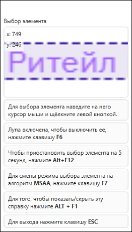
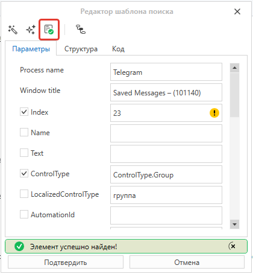
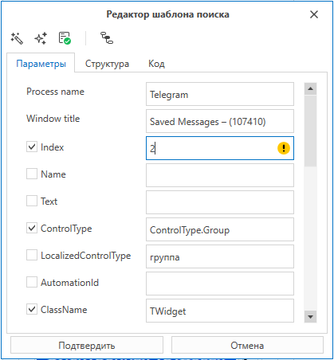
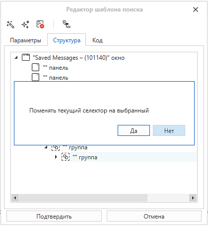
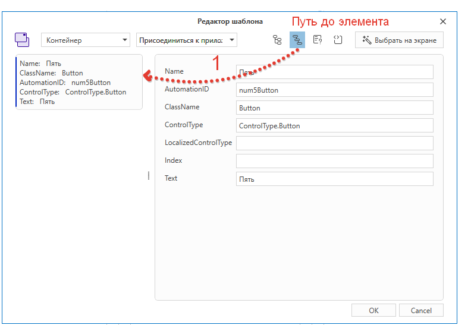
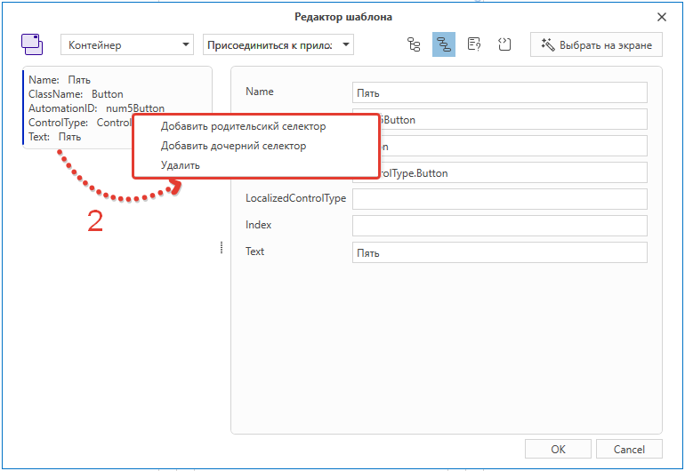
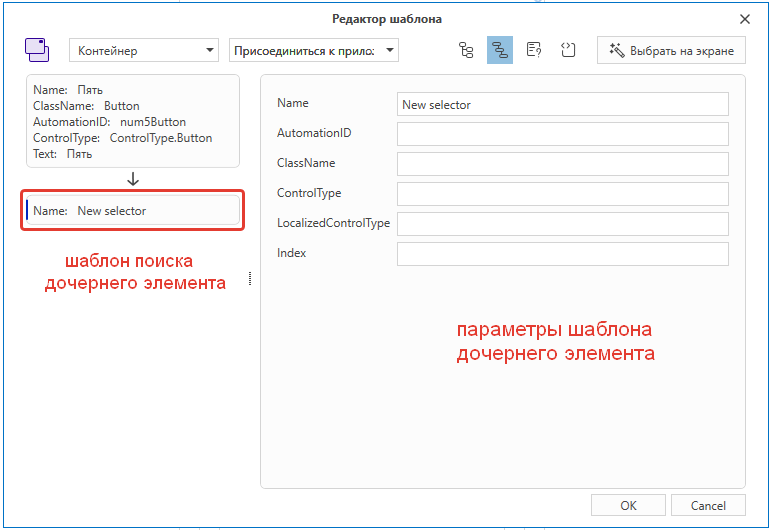

# Новый редактор шаблона поиска

В версии 23.9 внесены следующие изменения в **Редактор шаблона поиска**:

* В окне инструмента **Выбор элемента** (Element selection) добавлены подсказки с описанием горячих клавиш. 
  
  

* Проверить корректность шаблона (селектора) теперь можно на этапе выбора свойств. Кнопка **Валидация настроек шаблона** запускает проверку текущих настроек - результат отображается внизу редактора. 

    
   
* Добавлены всплывающие подсказки, помогающие скорректировать шаблон поиска. Значения выбранных свойств стали доступны для редактирования.
  
  

* Кроме того, появились вкладки **Структура** и **Код** (шаблон поиска в JSON), а также возможность быстро поменять текущий селектор.

  

* В окне редактора добавлена опция **Путь до элемента**, позволяющая управлять родительскими и дочерними селекторами. 

  

  Дочерние и родительские селекторы добавляются/удаляются при помощи команд контекстного меню.

  

  Функция полезна в ситуациях, когда бывает сложно определить нужный элемент управления только по его параметрам.

  

  
