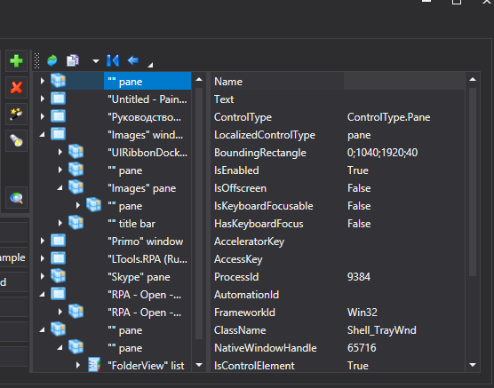

# Инспектор UI

Кнопка **Инспектор UI**  отображает модуль исследования интерфейса. Пример:

При помощи кнопок  и  происходит перенос выбранных элементов в шаблон.

Он поддерживает переключение режимов Win32/Java/MSAA. Работа с Java возможна после установки Java Access Bridge, но даже с ним можно исследовать не все приложения этого типа. В этом модуле можно исследовать структуру приложения.
