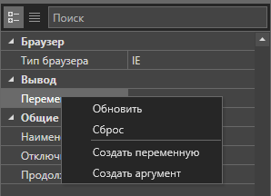
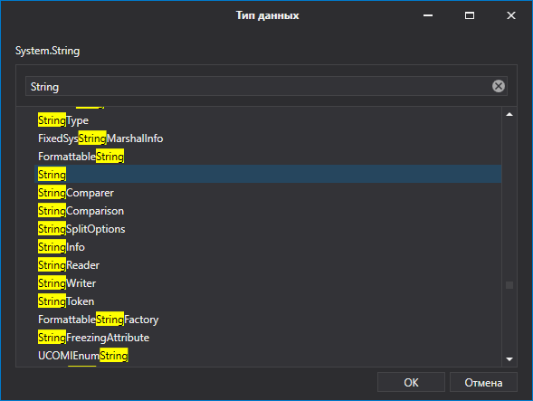
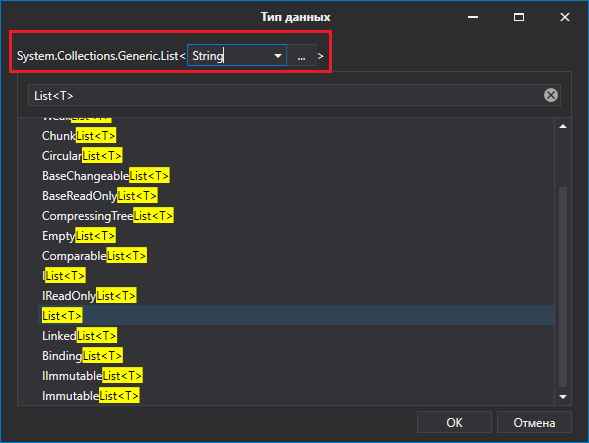
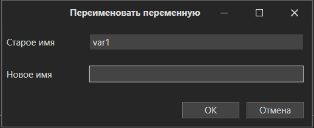
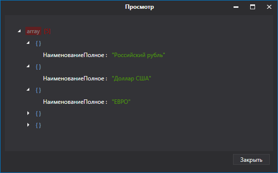
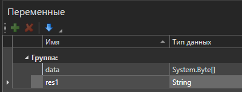

# Переменные

Переменные используются в работе сценариев для хранения промежуточных данных. Управление всеми переменными процесса осуществляется на панели **Переменные**. По умолчанию она расположена внизу экрана:

Состав переменной:

* **Имя переменной** – задается в соответствии с правилами выбранного языка (C#, Python или JavaScript). Обязательное свойство.
* **Группа** - позволяет группировать переменные по общему признаку. Опциональное свойство.
* **Тип данных** – тип данных переменной на выбранном языке. Обязательное свойство.
* **Значение по умолчанию** – выражение на выбранном языке программирования. Результат выполнения выражения будет присвоен переменной. Опциональное свойство: если переменной не задано значение по умолчанию, то ее начальное значение будет NULL.

  > :large_blue_diamond: ***Примечание***. *Для типа [Double](https://learn.microsoft.com/en-us/dotnet/csharp/language-reference/builtin-types/floating-point-numeric-types) значение по умолчанию должно быть записано в формате `0.0` или `0d`.*

* **Комментарий** – текст, описывающий назначение переменной. Опциональное свойство.

## Создание

Добавить переменную можно двумя способами:

1\. Через свойства элемента. Для этого выделите нужное свойство, вызовите его контекстное меню и выберите команду **Создать переменную**. Тип данных будет определен автоматически - в соответствии с типом данных выбранного свойства.

2\. На панели **Переменные**:
* Нажмите кнопку **Создать переменную**  и заполните информацию о ее составе. Если переменной не задано значение по умолчанию, то ее значение будет NULL.

* Тип данных переменной является автодополняемым значением. Например, достаточно ввести `List<String>` и нажать `Enter`. Система сама приведет тип к `System.Collections.Generic.List<System.String>`. Чтобы увидеть полный список доступных типов, нажмите кнопку **"…"** рядом с соответствующим полем. После чего выберите нужное значение в списке:

  

  Для работы с обобщенными типами существует ассистент выбора обобщенного типа:

  

  :large_blue_diamond: ***Примечание***. *Созданную переменную впоследствии можно перетащить в свойство выбранного элемента*.

## Редактирование 
Чтобы изменить переменную, обратитесь к панели **Переменные** и дважды кликните строку с переменной, значение которой нужно изменить. Откроется окно редактирования.

Имя переменной рекомендуется изменять отдельно. Для этого на панели имеется кнопка **Переименовать переменную** . Только в этом случае изменения применятся ко всему процессу, в котором она используется.

:small_orange_diamond: ***Имя переменной не должно совпадать с именем параметра из шаблона поиска. Иначе она не переименуется. Пример: если для переменной задано имя Items, но в процессе также используется шаблон поиска с параметром Items, то переименование переменной не приведет к ожидаемому результату.***

## Отладка

При [отладке](https://docs.primo-rpa.ru/primo-rpa/primo-studio/process/debug) процесса текущее значение переменных доступно в панели [**Вывод**](https://docs.primo-rpa.ru/primo-rpa/primo-studio/process/debug#panel-vyvod) либо в панели **Переменные** в колонке **Текущее значение**:

Для удобного просмотра текущего значения нажмите кнопку **Просмотр** . Откроется окно просмотра значения в формате JSON. 

Выбранное значение можно скопировать горячими клавишами `Ctrl` + `C` либо командой **Копировать** (контекстное меню). Значение попадет в буфер обмена в текстовом виде. Структурированные данные сериализуются в JSON-формат и также будут доступны в виде текста.

Для изменения значения во время выполнения процесса нажмите кнопку **Изменить значение** .

В появившемся окне вставьте новое значение и нажмите кнопку **ОК**:

Для удаления переменной выделите нужную строку в таблице и нажмите кнопку **Удалить переменную**  либо клавишу `Delete`.
