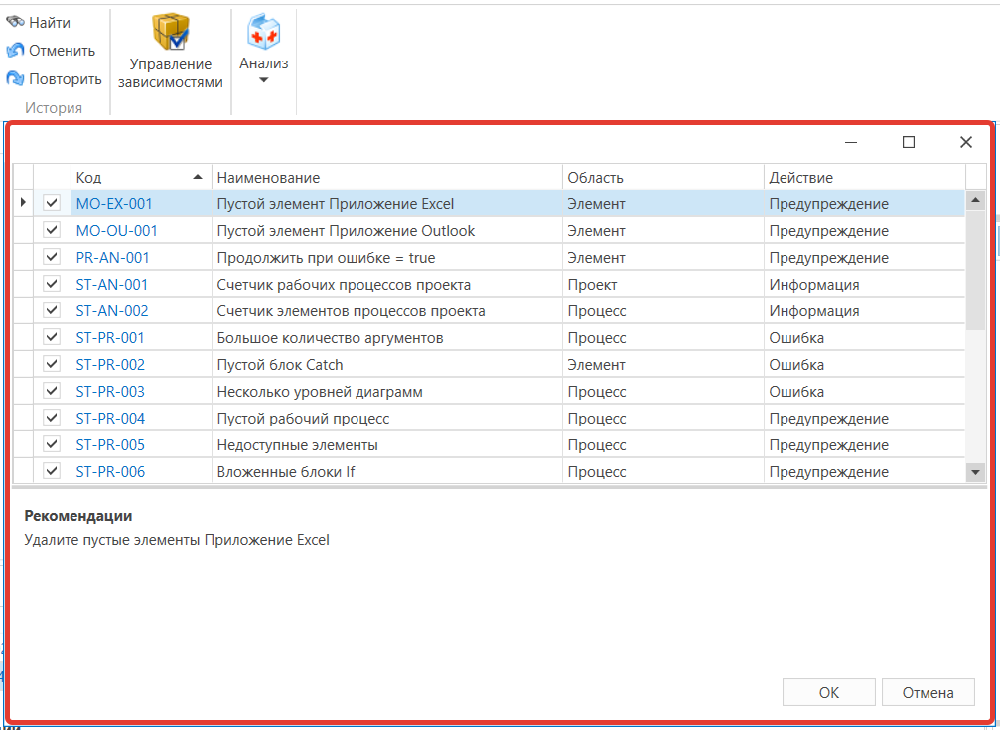

# Анализ проекта

Для проектов и процессов существует возможность проверки кода, который запускается кнопкой **Анализ**  на вкладке меню *Общие*.

Функция анализа позволяет проверить проект/процесс на соответствие стандартам качества и надежности. Для анализа используется набор правил для проверки кода, не связанных с выполнением проекта. Правила основаны на методах автоматизации и учитывают имена переменных и аргументов, пустые последовательности, ограничения пакетов и т. д. 

**ВАЖНО!** Статический анализатор проверяет код без фактического выполнения проекта. Таким образом, анализатор не выявляет ошибок при выполнении или компиляции. Для последнего используется инструмент [Отладки](https://docs.primo-rpa.ru/primo-rpa/primo-studio/process/debug).

## Настройки

Для настройки правил анализатора нажмите кнопку **Анализ ➝ Настройки** на вкладке меню *Общие*.\
Откроется окно со списком правил:


 
Каждое правило имеет свой код, имя, область применения и тип действия, которое будет выводиться в результатах анализа. 

Рядом с каждым правилом расположен чекбокс - с его помощью можно включить/отключить правило. Это позволяет настраивать параметры анализа в индивидуальном порядке. Если правило выключено, оно будет проигнорировано при запуске анализа. 

В столбце **Действие** указан тип сообщения, которое будет отображаться на панели **Анализ** при обнаружении несоответствия правилу: 

* Ошибка: создает ошибку на панели **Анализ**.
* Предупреждение: создает предупреждение.
* Информация: создает сообщение.

Действие для правила можно изменить: нажмите на него в соответствующем столбце и выберите другое значение из выпадающего списка.

## Результаты проверки 

Для запуска анализа кода нажмите кнопку **Анализ ➝ Анализировать проект** или **Анализ ➝ Анализировать процесс**.
Результат проверки отобразится в нижней части экрана на панели **Анализ**:


При найденном несоответствии будет выведено сообщение, содержащее имя и код правила, название файла, где найдено нарушение, и рекомендация по исправлению. Чтобы развернуть рекомендацию, нажмите на иконку **Подробнее** .

Результат проверки возможно экспортировать в файл \*.xlsx. Выгрузка доступна по кнопке **Экспорт в файл**  в верхней части панели:


## Запуск анализатора из консоли

Для запуска анализатора из командной строки используются параметры:

1. rulepath=<путь к файлу правил>.
2. projfile=<путь к проекту>.
3. outputfile=<путь к файлу результатов>.
4. errlog=<путь к файлу журнала>.
5. noclose - не закрывать по завершении анализа.
6. console - вывод в консоль.
7. output=\<json,xml,xlsx\> - формат файла результата.
8. lang=\<ru-RU\> - язык.

Пример:

```
Primo.ProjectAnalyzer.App.exe "rulepath=c:\Test\rules2.json" "projfile=C:\Users\Username\Documents\Primo\LibTest\project.ltp" noclose console "output=xlsx" "outputfile=c:\Test\aout.xlsx" "errlog=c:\Test\elog.txt" "lang=ru"
```


## Дополнительно

1\. Кроме анализатора кода также доступна автоматическая проверка синтаксиса, которая работает в фоновом режиме. Настройка является взаимодополняющей: если синтаксис содержит ошибку, на элементе, где она обнаружена, появится иконка предупреждения. При наведении на иконку можно увидеть подробные сведения об ошибке:


Чтобы установить фоновую проверку, перейдите в раздел меню **Файл ➝ Настройки ➝ Общие ➝ Отладчик** и включите параметр **Проверять синтаксис**.

2\. Существует возможность создавать собственные правила анализа. С инструкцией можно ознакомиться [здесь](https://docs.primo-rpa.ru/primo-rpa/developers/sdk/rules).
