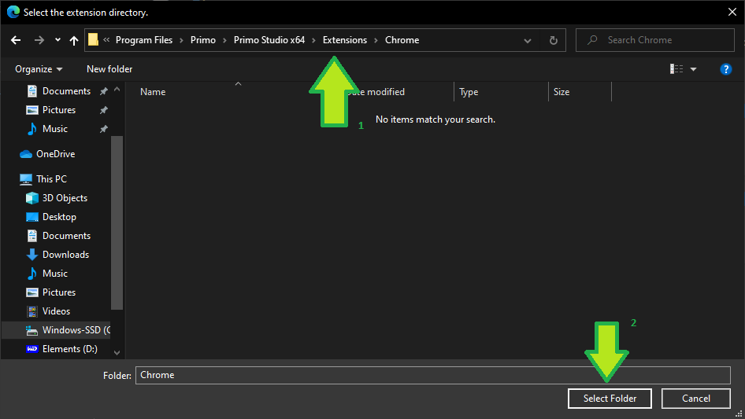
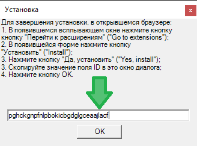

# Edge

## Упакованное расширение

* Находясь в Студии, перейдите в раздел **Файл > Настройки > Инструменты > Расширения**.
* Под значком **Edge** выберите из списка значение `Упакованное`, затем нажмите на сам значок браузера.
* Откроется окно, содержащее сохраненные файлы расширения.
* Перейдите в настройки браузера Edge и выберите пункт **Расширения**.
* Перетащите файл `chrome.crx` в окно Edge.
* Нажмите в отобразившемся окне кнопку **Добавить расширение**.

## Распакованное расширение

Для установки распакованного расширения браузера Edge:

* Находясь в Студии, перейдите в раздел **Файл > Настройки > Инструменты > Расширения**. Под значком **Edge** выберите из списка значение `Распакованное`, затем нажмите на сам значок.
* Откроется браузер Edge, окно с файлами расширения и диалог Installation.
* Перейдите в настройки браузера Edge и выберите пункт **Расширения**.
* В появившемся окне нажмите кнопку **Загрузить распакованное** (Load unpacked):
  > *Если кнопки нет, включите параметр **Режим разработчика**.*

* В качестве пути укажите папку с файлами расширения, которое открылось после нажатия на значок **Edge**:

* Скопируйте значение поля **ID** в открывшемся окне:

* И вставьте значение в окно Installation, затем нажмите **ОК**:

* Расширение будет установлено.

**Примечание**. Проверить, что расширение установлено успешно, можно в настройках браузера в разделе расширений.

