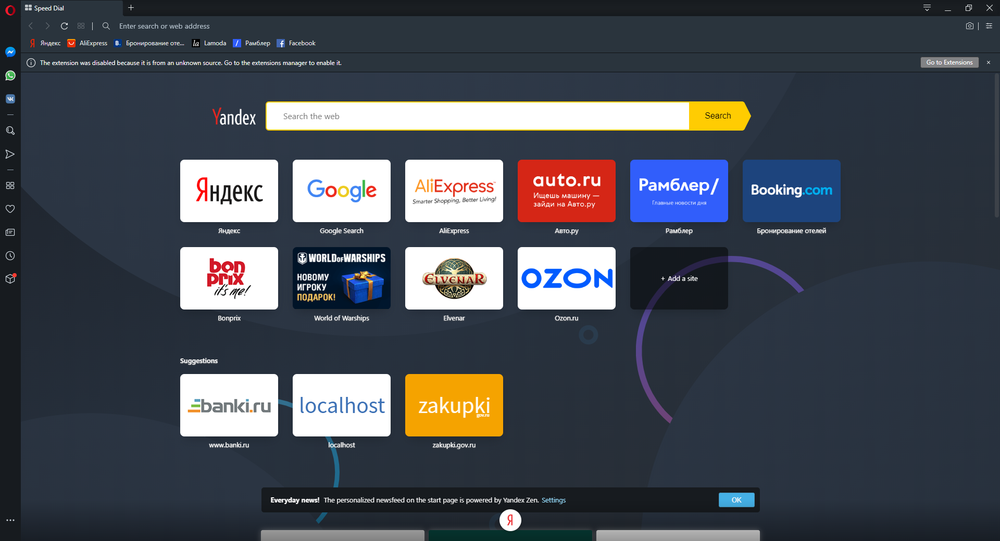
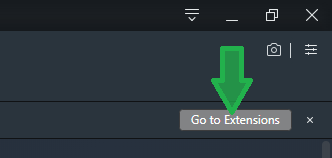
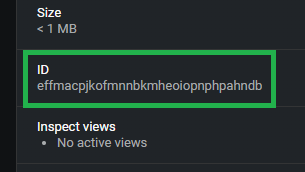
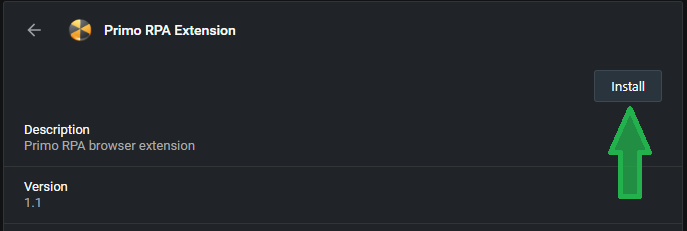
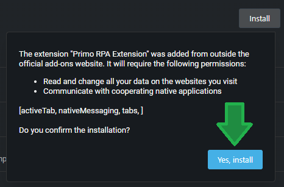
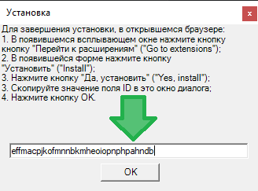
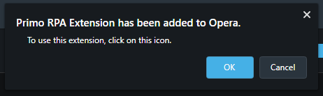

# Opera (Более недоступно)

Для установки расширения для браузера Opera необходимо:

* Нажать на значок Opera в Primo в меню Настройки - Инструменты - Расширения
* Откроется браузер и появится уведомление о том, что расширение деактивировано.&#x20;

* Необходимо нажать кнопку перейти к расширениям (Go to Extensions)

* В открывшемся окне по расширению скопировать поле ID

* Далее нажать Установить (Install)&#x20;

* Далее нажать Да, установить (Yes, install)

* В открывшемся окне вставить ID из буфера обмена и нажать ОК

* Расширение будет установлено, для использования расширения, нажмите ОК

