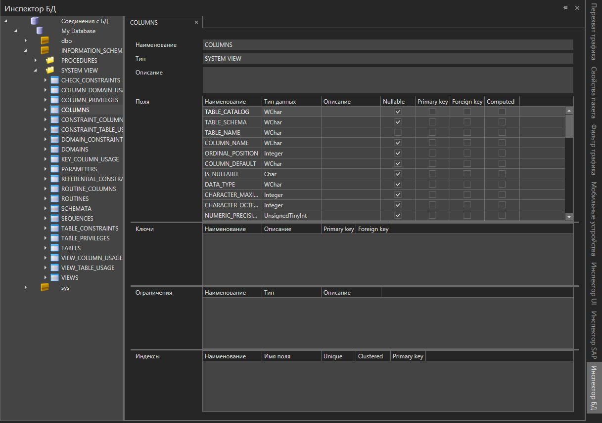
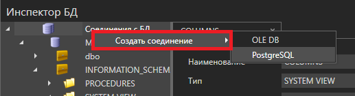
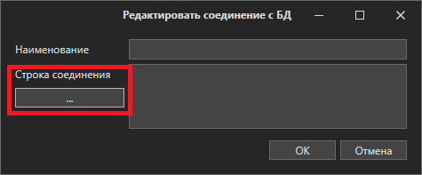
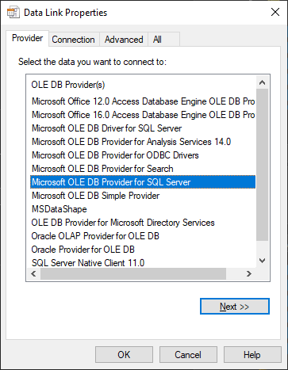
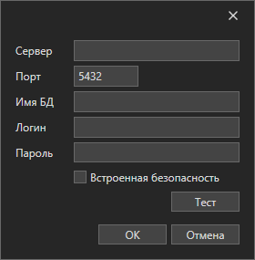
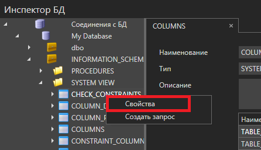
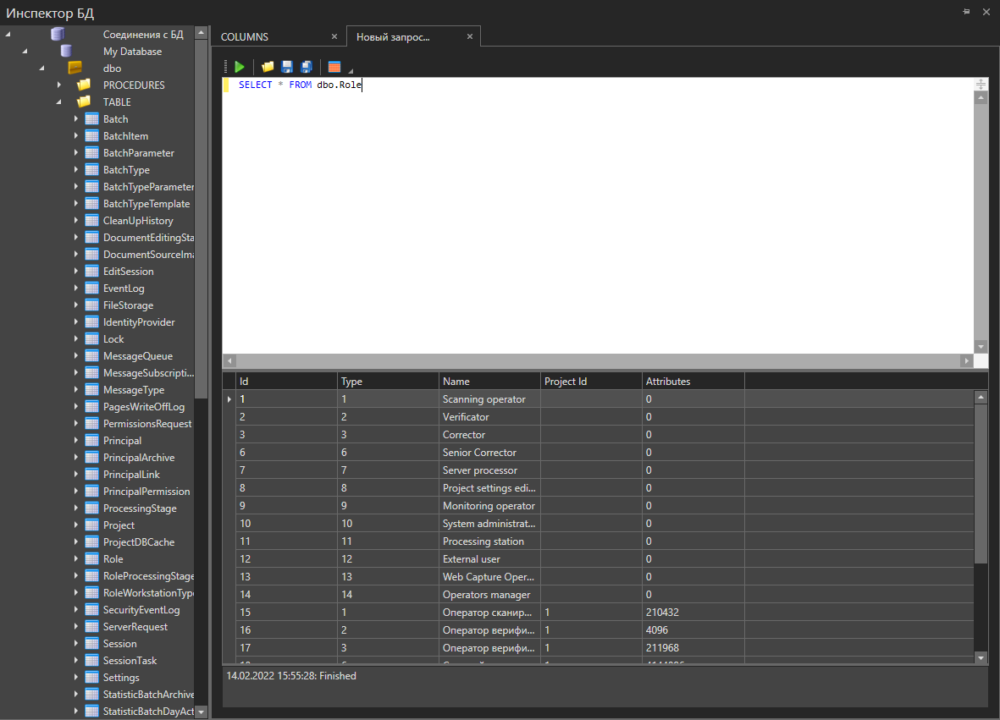

# Инспектор БД

Инструмент "Инспектор БД" служит для оперативного изучения и манипулирования структурой и данными доступных БД.

Для соединения с БД необходимо нажать кнопку "Создать соединение" контекстного меню и выбрать тип драйвера

Для вызова диалога редактирования строки соединения можно использовать кнопку "..."

**Подключение OLE DB**

При данном типе подключения необходимо установить драйвер соответствующей СУБД на локальную рабочую станцию. При создании строки соединения можно будет воспользоваться мастером подключений OLE DB

**Подключение PostgreSQL**

При подключении PostgreSQL драйвера OLE DB не используются

**Просмотр свойств сущностей БД**

Для просмотра информации о сущности, нужно выбрать ее в дереве структуры БД, нажать правой кнопкой мыши и выбрать пункт Свойства

**Выполнение запроса к БД**

Для выполнения запроса к БД необходимо кликнуть пункт "Создать запрос" контекстного меню дерева структуры БД

В появившейся закладке можно вводить текст запроса и выполнять его клавишей Запуск. Если запрос подразумевает получение данных, данные будут отображены в таблице в нижней части закладки

Для экспорта полученных данных в формате CSV необходимо нажать кнопку "Сохранить результаты"
